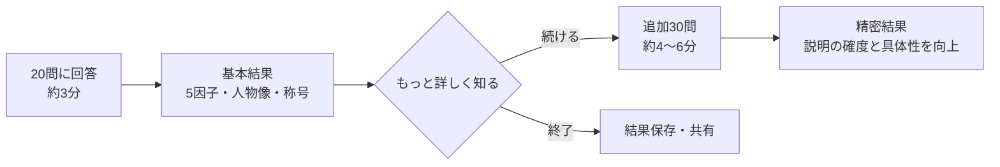

# 構想たたき台: エンタメ性と信頼性を両立するビッグファイブ診断

| 作成日 | 作成者 | 状態 |
|--------|--------|------|
| 2026-07-20 | Codex（ユーザーとの壁打ちをもとに作成） | 構想段階（フィードバック募集中） |

> ⚠ この資料は思いつき段階のたたき台です。【想定】は仮置き、【要確認】は未確定事項を示します。

## 1. 一言でいうと

公開されたビッグファイブ尺度を測定の土台にしながら、結果を具体的な人物像や称号として楽しく受け取れる性格診断アプリを作る。
最初の20問で基本結果を返し、希望者は50問まで続けると結果が精密になる二段階方式を有力案とする。

## 2. 背景・課題

性格診断には「自分のことを言い当てられたようで面白い」という魅力がある。一方、独自のタイプ分類だけでは判定根拠が不透明になりやすく、結果への信頼を得にくい。

今回の優先順位は次のとおり。

1. 結果への信頼
2. 自分を言い当てられる面白さ
3. 仕事や人間関係への実用性

そのため、測定ロジックは研究蓄積と公開尺度のあるビッグファイブを採用し、エンタメ性は採点ロジックを歪めず、結果の文章・演出・称号で加えるのが適している。

## 3. 提案するアイデア

診断を二段階にする。

- 20問時点: Mini-IPIP相当の5因子スコアを使い、広い性格傾向を示す
- 50問時点: 各因子10問のIPIP Big-Five Markers相当で、5因子の安定性を高める
- 結果表示: 元の連続スコアを必ず表示し、その上に独自の称号や人物像を重ねる
- 独自称号: 心理尺度上の「タイプ」ではなく、結果を楽しく読むための表現であることを明示する

### 設問数による診断の違い

| 設問数 | 所要時間の目安 | 測れる内容 | 診断結果の使い方 | 評価 |
|--------|----------------|------------|------------------|------|
| 10問 | 1〜2分 | 5因子を各2問で概観 | お試し、導入、SNS企画 | 信頼を最優先する本編には短すぎる |
| 20問 | 2〜4分 | 5因子を各4問で測定 | 基本結果、カジュアル診断 | 短さと根拠のバランスが良い |
| 50問 | 6〜10分 | 5因子を各10問で測定 | 本編、個人向け詳細レポート | 初版の本命 |
| 120問 | 15〜25分 | 5因子に加えて30の下位側面 | 本格的な自己分析レポート | 精密だが初版には重い |

所要時間は、1問あたり約6〜10秒で回答する場合の【想定】。実際はスマートフォンで計測し、離脱率と合わせて調整する。

## 4. 想定ユーザーと利用シーン

【想定】対象は、心理学の専門知識を持たない一般ユーザー。

- SNSや友人の紹介から訪れ、数分で自分の性格を知りたい
- 無料診断を試し、「なぜその結果になったか」も確認したい
- 結果を友人と見せ合い、違いや共通点を楽しみたい
- 将来的には、仕事や人間関係での行動傾向を自己理解に役立てたい

## 5. 主要機能の候補

| 機能 | 概要 | 優先度 |
|------|------|--------|
| 二段階診断 | 20問で基本結果、追加30問で精密化 | 核 |
| 5段階回答 | 直感的にタップして回答 | 核 |
| 逆転項目の採点 | 公開尺度の採点規則に従う | 核 |
| 5因子スコア | 生点または適切に標準化した値を表示 | 核 |
| 結果文章 | 高低と因子の組み合わせから具体的に説明 | 核 |
| エンタメ称号 | 結果表現用の短い名称とビジュアル | 核 |
| 結果の根拠表示 | 使用尺度、設問数、結果の限界を説明 | 核 |
| 結果画像の共有 | 称号、グラフ、短い説明を画像化 | あれば |
| 回答の一時保存 | 離脱後に同じ端末で再開 | あれば |
| 仕事・対人ヒント | スコアに基づく行動上の示唆 | 将来 |
| 120問の本格版 | 30下位側面を含む詳細診断 | 将来 |

### エンタメ性の設計原則

- 回答中は因子名を見せず、回答を誘導しない
- 「あなたは○○型」と断定せず、「今回のプロフィールを表す称号」として提示する
- 良い面だけでなく、強みが裏返ったときの困りごとも書く
- 高得点を優秀、低得点を劣っているとは扱わない
- 結果文には行動場面と例外条件を含め、曖昧な褒め言葉だけにしない
- 「当たっている／違う」の任意フィードバックを集め、まず結果文章を改善する

## 6. 実現方式の選択肢

| 案 | 概要 | 良い点 | 気になる点 | ざっくり規模感 |
|----|------|--------|----------------|----------------|
| 松: 20問＋50問＋120問 | 段階別診断、30下位側面、詳細レポートまで作る | 商品として厚みがある | 初版の検証範囲が広すぎる | 【想定】数ヶ月 |
| 竹: 20問＋50問 | 基本結果と精密化を一つの体験にする | 信頼と完走率を両立しやすい | 二段階の採点・表示設計が必要 | 【想定】数週間 |
| 梅: 20問のみ | Mini-IPIP相当で短い診断を作る | 早く公開できる | 個別性の高い結果文を作りにくい | 【想定】数日〜数週間 |

推奨は竹案。最初の20問をMini-IPIPとして成立させ、追加回答後は50問版として再採点する設計を検討する。

## 7. 期待効果とリスク・懸念

### 期待効果

- 「公開尺度を使用」という説明が結果への信頼につながる
- 20問時点で結果が得られるため、50問を必須にするより離脱を抑えやすい
- 称号や共有画像により、ビッグファイブの地味さを補える
- 共通の回答・採点・結果表示基盤を、後続のエニアグラム等に転用できる

### リスク・懸念

- 英語尺度を独自翻訳すると、元研究と同じ妥当性を主張できなくなる
- 日本語訳が公開されていても、対象ユーザーに対する再検証は別途必要
- 母集団データなしに「日本人の上位10%」などと表示すると根拠を損なう
- 組み合わせ文章が魅力的でも、スコアから導けない断定を入れると占い化する
- 20問と50問の結果が大きく変わる場合の説明が必要
- 自己申告式であり、臨床診断・採用判定・能力測定には使えない

## 8. フィードバックをもらいたい点

1. 最初の公開版は、20問で基本結果を返した後、追加30問で精密化する方式でよいか？
   → 一段階にするか二段階にするかで、画面遷移と採点データ構造が変わる。
2. 称号は「親しみやすいキャラクター型」と「落ち着いた人物プロフィール型」のどちらに寄せるか？
   → 対象年齢、ビジュアル、SNS共有時の印象が変わる。
3. 初版は個人の自己理解だけに絞り、仕事・対人関係の助言を後続に回してよいか？
   → 助言の根拠調査と結果文章の量が大きく変わる。

## 補助メモ（requirements-definition への申し送り）

### 初回価値と重大な行き止まり

- 最初の成果: 20問回答後に、5因子スコア、人物像、称号を得る
- 到達を妨げる前提: アカウント登録は要求しない【想定】
- 安全な中断・復帰: ブラウザ内に回答途中の状態を保存する【想定】

### 要件定義で決めるライフサイクル

| 対象リソース | 未決の観点 | 決定する工程 |
|--------------|------------|--------------|
| 回答データ | 保存期間、匿名化、削除、分析利用への同意 | requirements-definition |
| 診断結果 | URL共有の有効期限、非公開化、再診断時の扱い | requirements-definition |
| 結果文章 | バージョン管理、スコア境界、更新後の旧結果表示 | requirements-definition |

## 9. 未確定事項と次のステップ

- 【要確認】想定ユーザーの年齢層と公開範囲
- 【要確認】使用する日本語設問と、その利用条件・検証状況
- 【要確認】20問から50問へ拡張した際の正式な項目構成と順序
- 【要確認】称号の世界観とビジュアル方針
- 【要確認】比較表示に用いる母集団データ
- 次のステップ: 構想へのフィードバック反映 → 使用尺度の調査 → 要件定義

## 10. 決定ログ

| 項目 | 判断 | 理由 | 再検討の条件 |
|------|------|------|--------------|
| 最初の診断理論 | ビッグファイブ | 結果への信頼を最優先するため | 初版公開後に共通基盤が安定したら他理論を追加 |
| エニアグラム | 後続 | エンタメ性は高いが、最初の信頼基盤にはしにくい | タイプ診断への需要を確認できたら |
| DISC系 | 後続 | 商標・既存商品の権利確認と独自設計が必要 | 法人・仕事向け需要を確認できたら |
| 10問版 | 本編には採用しない | 個人結果としての粒度が不足する | 広告・導入用の超短縮版が必要になったら |
| 120問版 | 将来案 | 30下位側面を測れるが初版には長い | 50問版の完走率と詳細需要を確認できたら |
| 独自タイプ判定 | 補助的な称号に限定 | 連続尺度を根拠なく固定タイプへ変換しないため | 妥当な分類データが得られたら |

## 11. 要件定義への引継ぎ

| 種別 | 項目 | 状態 | 次工程 |
|------|------|------|--------|
| コア体験 | 20問で基本結果を得る | 【想定】 | 要件定義 |
| 精密化 | 追加30問で50問版の結果を得る | 【想定】 | 尺度調査・要件定義 |
| 信頼性 | 公開尺度と採点根拠を表示する | 確定 | 要件定義 |
| エンタメ | 結果に独自称号と具体的な人物像を表示する | 確定 | 要件定義 |
| 表現 | 称号は心理尺度上の固定タイプと扱わない | 確定 | 要件定義 |
| 日本語尺度 | 採用する訳と妥当性の確認 | 【要確認】 | 尺度調査 |
| 比較スコア | 母集団、年齢、性別等の扱い | 【要確認】 | 尺度調査・要件定義 |
| データ | 回答保存、匿名化、同意、削除 | 【要確認】 | 要件定義 |
| 後続診断 | エニアグラム、DISC系 | 【想定】後続 | 将来の要件定義 |
