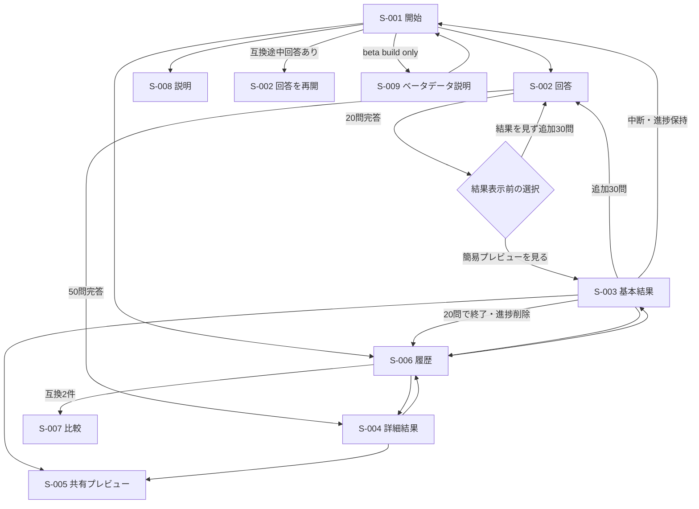

# Big Five自己理解支援ツール 画面設計

| 項目 | 内容 |
|---|---|
| 設計版 | 0.9 |
| 作成日 | 2026-07-20 |
| 更新日 | 2026-07-30 |
| 入力要件 | 要件定義書v1.14 |
| 対象 | スマートフォン優先、PC対応 |

## 1. 画面方式

- 【想定】1つの`index.html`を入口とするクライアントサイドアプリ。
- 【想定】GitHub Pagesの404を避けるため`#/start`等のハッシュルートを使う。
- URLへ回答・スコア・結果・個人情報を含めない。
- 直接アクセス時は端末保存と現在状態を検証し、安全な画面へ遷移する。
- ブラウザバックだけに依存せず、画面内に明示的な戻る・中断・破棄導線を用意する。

### 1.1 コンテンツ読込の現在地

Q-006およびT-005/F-002/F-005/F-006/F-016のCSVコンテンツ作成基盤は実装済みで、人は`content/source/`のCSVだけを編集する。3つのrelease schema、4つのコンパイラ、決定的な7 JSON builder、atomic writer、CSV/ES Modules parity testがあるが、画面はまだ既存ES Modulesをruntime compatibility authorityとして使い、`app/content/` JSONをfetchしない。

`result-text-v1`は237件の不変な履歴互換版で、別管理のQ-006全18 approval gateは2026-07-28にすべてapprovedとなっている。現行ES Modules runtimeの`result-text-v2`は基本237件に、TR-0〜TR-4承認済みの称号別`titleReflection`153件を加えた390件で、基本文面には承認済み修正27件を含む。v2の結果文と根拠の対応行は267件、実行時の根拠定義は引き続き固定6件である。approved release未選択、Q-006関連行status未昇格、Q-012正式release未完了、Q-013のP-0〜P-6承認・正式runtime接続未完了はrelease readinessを妨げる別条件として維持する。通常モードは外部通信0件、CSPは`connect-src 'none'`である。JSON runtime loadingとPages deploymentは`docs/superpowers/plans/2026-07-26-csv-content-activation-pages.md`で後続対応する。

## 2. 画面一覧

| 画面ID | ルート | 名称 | 対応機能ID |
|---|---|---|---|
| S-001 | `#/start` | 開始 | F-001, F-004, F-007, F-009, F-014 |
| S-002 | `#/answer` | 回答 | F-002, F-003, F-004, F-013, F-015 |
| S-003 | `#/result?resultId=<UUID>`（`mode=preview20`） | 基本結果 | F-005, F-007, F-008, F-014, F-016, F-018 |
| S-004 | `#/result?resultId=<UUID>`（`mode=detail50`） | 詳細結果 | F-006, F-007, F-008, F-014, F-016, F-018 |
| S-005 | `#/share` | 共有プレビュー | F-011, F-012, F-014, F-015, F-016, F-018 |
| S-006 | `#/history` | 履歴 | F-009, F-010, F-013, F-014, F-015 |
| S-007 | `#/compare` | 比較 | F-010, F-015 |
| S-008 | `#/about` | 説明 | F-001, F-002, F-007, F-014 |
| S-009 | `#/beta-data` | ベータデータ説明 | F-017 |

## 3. 主要遷移

## 4. 共通レイアウト・操作

- 本文最大幅を設け、PCで行長を過度に広げない。
- 360px幅で横スクロールを発生させない。
- 主要ボタンのタップ領域は44×44 CSS px以上を目標とする。
- フォーカスを常に視認可能にし、モーダルを使う場合はフォーカストラップと復帰先を実装する。
- 色だけで選択・高低・増減・エラーを表さず、文言・記号・線種を併用する。
- `prefers-reduced-motion`では結果発表アニメーションを省略する。
- 読み上げ順とDOM順を一致させる。
- 長い結果文は省略せず折り返す。補足節は開閉可能にしても、重要な注意書きは初期表示する。
- 全画面に`Big Five 自己理解チェック`と英字副題`BIG FIVE SELF UNDERSTANDING`を小さく控えめな共通ヘッダーとして表示する。ヘッダー操作は折り返さず、結果の称号・猫や設問本文より強くしない。
- 共通ヘッダーは標準でアイコン`38px × 38px`、アプリ名`1.02rem`、副題`0.68rem`、アイコンと文字の間`12px`とし、下padding `18px`、1pxの区切り線、下margin `26px`を使う。
- 380px以下はアイコン`34px × 34px`、アプリ名`0.84rem`、副題`0.55rem`とする。340px以下は右側操作を1行に保つ最小fallbackとして、アイコン`32px × 32px`、アプリ名`0.8rem`、副題`0.52rem`、ヘッダー要素間`4px`、アイコンと文字の間`6px`、右側操作`0.7rem`とする。
- 画面見出しは、緑のkickerまたは進捗と、その下の`h1`を組み合わせた共通スタックを使う。同じ役割の見出しは画面間で同じ開始位置に置き、回答設問など画面固有の文字階層は維持する。
- 設問文は正式文言を変更せず、左揃え、適切な最大幅・行間、balanced wrappingで不自然な1語残りを避ける。
- 回答画面の文字スケールは結果・履歴へ一律適用せず、各画面の情報量に合わせて個別に定める。

## 5. S-001 開始

### 表示

- 共通ヘッダー
- 英字見出し`SELF CHECK`と主見出し`自分のことを知る`
- `Big Fiveは、性格傾向を5つの因子から捉える考え方です。本チェックではIPIP日本語50項目版を使用し、回答から現在の傾向を振り返ります。`
- Big Five（五因子モデル）を使用すること
- 対象: 18歳以上、本人が一人で回答
- 20問・50問のおおよその所要時間
- 臨床診断、能力・採用判定ではないこと
- 端末保存と、削除・端末変更で復元できないこと
- アプリ版・診断関連版への導線
- 互換途中回答がある場合のみ「途中から再開する」。簡易プレビュー表示済みの20問進捗では「残り30問を再開する」
- 「診断結果の履歴を見る」を常時表示
- ベータ版では、回答開始ボタンより前に匿名集計を行うことを示す短い通知とS-009への導線
- 共通ヘッダー直下では、`SELF CHECK`から診断開始・再開操作までを一つの白い`start-main-panel`へまとめる。`このツールについて`は同パネル内の説明ブロックとし、別の大きな白カード、角丸、影を重ねない。
- 診断開始・再開操作は`.start-actions`へまとめる。十分な横幅では同幅2列、狭幅では同幅1列とし、いずれも操作間隔は12pxとする。
- 「診断結果の履歴を見る」と「この診断について」は`start-main-panel`の外に置く。結果、履歴、比較、回答の本文へ同パネルを適用しない。

### 操作

- 「診断を始める」
- 互換途中回答がある場合だけ、状態に応じて「途中から再開する」または「残り30問を再開する」
- 「診断結果の履歴を見る」
- 「尺度・結果の読み方」

### 状態・エラー

- 保存不可でも新規開始を許可し、「この環境では続きと履歴を保存できません」と通知する。
- 不正な途中回答は「続きから」を出さず、壊れた記録だけを除外する。
- 互換途中回答がある状態で新規開始を選んだ場合は、既存の途中回答を破棄することを確認する。取消では既存進捗を保持し、確定時だけ同じ診断種別の進捗を新規状態へ置き換える。保存済み結果は削除しない。

## 6. S-002 回答

`renderQuestionnaireScreen`とlive controllerの回答・保存・分岐、2026-07-27承認の共通ヘッダー、明示的な中断、状態別再開、簡易プレビュー終了、新規開始時の置換確認は実装・テスト済みである。`#/answer`で設問phaseと20問分岐phaseをexact view modelとして分離し、回答、戻る、中断、破棄、互換途中回答の再開を既存state/storage APIへ接続する。保存失敗時もメモリ上の回答を維持して通知する。20問の`continueHidden`は結果を作らず21問目へ進み、`showPreview`と50問完答だけがanswer-freeのResultSnapshotを生成する。

### 表示

- 設問本文
- 5件法の選択肢。値の方向を誤解しない自然言語ラベル
- 緑の進捗と、その下の設問`h1`からなる共通見出し
- 他画面と同じ通常の共通ヘッダーと、折り返さない「中断してトップへ」
- 「前へ」「その他の操作」「回答を破棄」。破棄は中断と区別した管理操作
- 自動保存状態。成功を毎回読み上げず、失敗だけ通知

### 文字と余白

- 設問本文はスマートフォンで20px相当、広い画面で22px相当、太字、行間1.5を基準とする。CSSでは`1.25rem`から`1.375rem`の範囲で実装し、トップ画面用の大見出し規則を継承させない。
- 5件法の選択肢は16px相当、行間1.5、最低高56px、上下14px・左右16px相当の余白を基準とする。2行になっても文字を縮小しない。
- 現在位置と全体数は12px相当の緑の進捗として表示し、設問本文より強くしない。
- 設問本文から選択肢群までを24px相当、選択肢間を12px相当の基準間隔とする。
- 360px幅で設問本文が自然に2〜3行へ収まり、不自然な1語残り、横スクロール、選択肢のタップ領域不足を生じさせない。
- 配色、角丸、猫アプリとしての既存トーンは維持する。外部参考画面の配色やブランド意匠は移植しない。

### 操作

- 回答タップで選択し、次の設問へ進む。
- 前の設問へ戻り、回答を変更できる。
- 「中断してトップへ」は回答数に関係なく利用でき、ProgressRecordを保持して開始画面へ戻る。
- 破棄は確認後に開始画面へ戻る。
- 再読み込みは互換版なら保存位置から再開する。
- 保存不可の場合は、中断すると再開できず回答を失うことを操作前に通知する。

### 20問完答時

結果や因子名を表示する前に、次の2択を出す。

- 「20問の簡易プレビューを見る」
- 「結果を見ずに、あと30問続ける」

後者ではスコア、仮称号、仮猫、色候補を描画せず、21問目へ進む。

20問完答・選択前に中断した場合は、再開時にこの分岐へ戻す。簡易プレビュー表示後のProgressRecordは追加30問用として保持し、開始画面の「残り30問を再開する」から21問目へ進める。

### バリデーション

- 未回答のまま次へ進ませない。
- 値は整数1〜5だけを受け付ける。
- 設問ID、現在位置、定義版が一致しない場合は処理を止め、安全な再開始を案内する。

## 7. S-003 基本結果

Q-006の版付き結果文、合成、snapshotとlive完答callerは実装・独立レビュー済みである。20問の`showPreview`は選択されたQ-012 manifest entryの個別`assetVersion`とTitleProfileの`defaultPaletteId`を保存し、answer-freeの結果を`#/result?resultId=...`へ表示する。保存済みsnapshotは履歴からも同画面を開け、対応する互換ProgressRecordが残る場合だけ追加30問へ進める。結果画面は称号・猫hero、称号理由、称号別`titleReflection`を独立sectionにし、名前付きレーダー、固定順5因子のコンパクトな行・棒・数値、同時1因子／同一因子内1詳細だけの二段階開閉、設問構成sheet、4つの固定方法sheetまで接続済みである。保存済みsnapshotの`scaleVersion`、`questionVersion`、`scoringVersion`が登録済み診断定義と完全一致する場合だけ、その定義の設問構成・方法説明を表示する。未登録の履歴版では現行版の件数・限界・出典を流用せず、説明を利用できない旨と、保存済みの称号・スコア・結果文は確認できる旨を表示する。`result-text-v1`の237件は全18 gateがapprovedとなり、Content Approvalを2026-07-28に完了した。`result-text-v2`の153件の`titleReflection`はTR-0〜TR-4ですべて承認済みで、現行runtimeへ実装済みである。approved release未選択、Q-012正式release、Q-013 production data、実際のT-007共有UIは未完了として維持する。

### ファーストビュー

- 英字見出し`PREVIEW RESULT`と主見出し「20問簡易プレビュー」
- 仮称号、仮猫キャラクター
- 「本アプリ独自のプロフィール表現」
- 称号に対応する中立副題
- 称号になった理由
- 「簡易結果からの参考情報」と分かる「振り返りのヒント」1件
- 枠・5軸・補助線・数値を備えたレーダーチャート
- 固定因子順の因子名、棒、数値、矢印と「詳しく見る」を含む全幅の選択行
- 日本語版20項目が独立検証済みではない旨

現行`result-text-v2`の通常表示入力は`RenderedResultText` 8件（`titleSubtitle`、`titleReason`、固定順1件目の`titleReflection`、`FACTOR_ORDER`順の5因子それぞれの観察文）である。heroの中立副題と独立した「この称号になった理由」に続けて「振り返りのヒント」1件を表示し、その後の5因子の段階展開から全因子文へ到達できる。称号別振り返り定義が完全な3件組でない場合は当該section全体を省略し、称号・因子を維持した7件のゼロ-reflection fallbackを表示する。部分的な振り返りは表示しない。20問簡易プレビューの限界と「50問で変わり得る」注意は、版付き結果文とは別の必須UI文面として表示する。

### 続き

- 境界・僅差時の補足
- 同時に1因子だけ開く短い説明。20問では過度な詳細節を表示しない
- 50問で確認できる内容
- 猫カード／共有カードプレビュー近くの標準1＋代替2の色候補と、同じ主結果グループ内で意味を分けた3場面×各2件の香調候補。各香調には1〜2件の「香りの素材例」を表示し、追加回答は要求しない
- 「あと30問続ける」
- 「中断してトップへ」。20問ProgressRecordを保持する
- 控えめな「簡易プレビューで終了する」。20問ResultSnapshotを残しProgressRecordだけを削除する
- 「共有する」「履歴を見る」

### 失敗時

- 猫画像失敗: 代替文、称号、中立副題、称号理由、5観察文、根拠への導線を維持
- Canvas失敗: HTMLの数値一覧、結果文、根拠への導線を維持
- 共有API失敗: 共有テキストを維持し、Clipboardを利用できない場合も選択可能テキストへ到達可能にする
- 履歴保存失敗: 結果を維持し、保存不可を通知

## 8. S-004 詳細結果

50問完答callerはanswer-freeのsnapshotを生成・保存し、`#/result?resultId=...`でS-004を開く。保存成功時は結果追加とProgressRecord削除を原子的に行い、保存失敗時もlive結果と文面を維持して通知し、callerは回答地図と完答ProgressRecordへの参照を破棄する。現行`result-text-v2`の通常45件は、中立副題、称号になった理由、固定順3件の`titleReflection`、続いてsection-first・`FACTOR_ORDER`順の5因子それぞれの観察文、強み、裏返り、仕事、人間関係、ストレス、問いかけ、行動ヒントで構成する。表示時は因子文だけをfactor-firstへ不変投影し、同時1因子／同一因子内1詳細だけを開く二段階開閉から全因子文へ到達できる。称号別振り返り定義が完全な3件組でない場合はsection全体を省略して42件のゼロ-reflection fallbackを表示し、部分的な振り返りは受理しない。

### 表示

- 英字見出し`DETAIL RESULT`と主見出し「50問詳細結果」
- 称号、猫、中立副題、レーダーチャート
- 称号になった理由
- 「振り返りのヒント」1件。共通補助文は設けず、各提案を「〜してみませんか。」で結ぶ。残り最大2件を「ほかのヒントを見る」で展開
- 称号の代表2因子と全5因子
- 名前付きレーダーと、固定因子順の因子名、棒、数値、矢印と「詳しく見る」を含む全幅の選択行
- 同時に1因子だけを展開し、「今の傾向」「活かしやすい強み」「強みの裏返り」「仕事」「人間関係」「ストレス」「振り返りと行動ヒント」の短いサマリを表示する
- 因子内の「詳しく見る」は同時に1カテゴリだけを開き、別因子・別カテゴリを開いたら既存の展開を閉じる。第三階層は設けない
- 因子一覧後の補助注記「因子を選ぶと、詳しい結果を確認できます。」
- 5因子の後の「結果の見方について」カード先頭に置く「因子ごとの設問構成を見る」。今回の結果が20問／50問のどちらかを示し、正方向・逆方向項目数だけを表示して設問本文と回答は表示しない
- 同カード内の「測定の土台」「スコアの計算方法」「この結果の限界」「出典・利用条件」を開くアクセシブルなボトムシート。閉じる操作を上部へ固定し、本文だけをスクロールし、正確なbackdrop clickとEscapeでも閉じられる
- 境界・僅差時の補足
- 猫カード／共有カードプレビューの近くに置く色候補と、猫由来と誤認させない香調候補。各香調の説明直後に1〜2件の「香りの素材例」を表示する
- 共有、履歴、再診断、「トップへ戻る」

猫画像、Canvasまたは共有APIが失敗しても、称号、結果文、根拠への導線、共有テキストへの経路を同じ結果画面から利用できるようにする。Clipboardも利用できない場合は選択可能テキストへ到達可能にする。

`トップへ戻る`は保存済みResultSnapshotなら確認なしで`#/start`へ移動する。履歴保存に失敗したlive結果では、戻ると再表示できないことを確認し、取消時は同じ結果画面を維持する。

2026-07-28の実ブラウザ検証では、320px、360px、960pxの結果画面で横overflowがないこと、因子と詳細の単一開閉、設問構成sheetと4方法sheet、保存済み50問結果のトップ直接遷移を確認し、console error／warningは0件だった。

### 表現制約

- 断定、優劣、適職・採用、臨床的助言を表示しない。
- 3番目以降の因子を省略しない。
- 色・香りを科学的診断や改善方法として表示しない。

## 9. 色候補の任意操作

S-003/S-004に複数パレットを表示する。

- 初期状態はTitleProfileDefinitionの標準パレット。
- 標準1件と代替2件、合計3件を固定表示する。
- 候補タップでカードプレビュー用の配色を変更する。
- 3候補は同じ3色の役割入替ではなく、各候補を独立した配色として見分けられる構成にする。
- 選択状態は色＋チェック＋名称で示す。
- 「選ばない」という追加回答を要求せず、標準状態のまま共有可能。
- 配色変更はスコア、称号、猫、結果文を変更しない。
- 履歴にパレットIDを保存し、後から同じカードを再生成できる。

香調候補は「ひと息つきたい」「気持ちを切り替えたい」「静かに取り組みたい」の固定順で、各2件、合計6件を同時表示する。通常結果では`ココロアロマ`、副題`～あなたらしさから着想した香り～`の下で、各香調の素材例1〜2件、短い印象、説明を表示する。共有プレビューでは各場面の代表1件、合計3件へ要約し、素材例と短い印象、共通注記`香りをイメージするための素材例です`を表示する。共有テキストには素材例を含めない。

## 10. S-005 共有プレビュー

実際の共有UI・共有カード・共有テキストはT-007の後続範囲である。先行する純粋な共有候補抽出境界では`titleReflection`を除外済みだが、これをS-005実装完了やブラウザQA完了の証拠にはしない。

### 表示

- 実際に外部へ出る画像
- 共有テキスト全文
- 20問／50問の区別
- 猫、称号、レーダー、短文、色候補反映、`ココロアロマ`の代表3件（場面名、素材例、短い印象）、共通注記、注意書き、版
- 共有テキストには香りの素材例を含めない
- 選択配色と猫が同系色の場合も確認できる、縁取り・影・背景プレートを含む完成時と同一のプレビュー
- 右上の差し色は選択パレットの副色由来の淡い装飾とし、暗色の面にしない
- 生回答や公開結果URLが含まれないこと

### 操作

- 「端末の共有メニュー」
- 「画像を保存」
- 「テキストをコピー」
- 「結果へ戻る」

利用可能な機能だけを表示する。実行前に画像Blobとテキストの生成成功を確認する。

### フォールバック順

1. 画像ファイル付きWeb Share
2. PNGダウンロード
3. テキストのClipboardコピー
4. 選択可能な共有テキスト表示

Q-007確定前の【想定】:

- PNG
- 猫画像は全体表示、中央配置、トリミングなし
- 選択パレットは維持し、猫の再配色や同系色パレットの除外は行わない
- 猫と隣接背景の分離が弱い場合は、明暗二重縁取り、影、ニュートラル背景プレートをカードテンプレート側で適応する
- 日本語テキストはCanvasへ描画前にフォント読込完了を待つ

## 11. S-006 履歴

簡潔な通常カード、Q-012猫サムネイルの個別遅延読込、保存済み結果への直接遷移、固定比較操作、履歴管理modal/dialogは実装・テスト済みである。管理dialogは明示的なclose、dialog自体だけのbackdrop click、native `cancel`とfallback keydownのEscape、内部へのfocus入場と起動元への復帰を持つ。`showModal`なし／例外時は明示的な全viewport fallback surfaceと中央panelを表示し、背景を`inert`＋`aria-hidden`で隔離する。Tab／Shift+Tabは閉じた`details`配下を除外し、`summary`を含む実際に到達可能な操作だけで循環する。

### 表示

- 新しい順の簡潔な結果カード
- 共通ヘッダー右側の「トップ画面へ」と、`HISTORY`／「診断結果の履歴」の共通見出し
- 小さな猫サムネイル、称号、実施日時、20問／50問バッジ、「結果を見る」
- 「結果を見る」は保存済みsnapshotを通常のS-003/S-004で開く
- 空状態: 「まだ結果がありません」と診断開始導線

### 操作

- 通常時の固定下部アクションバーから「結果を比較する」
- 明示的な`履歴削除`ボタンから既存の`データの管理`ボトムシート／モーダルを開き、日時・20問／50問で識別できる個別削除、全削除、版情報を表示
- 明示的な「閉じる」、背景部分のタップ、Escキーで閉じる。内部タップでは閉じず、終了後は`履歴削除`へフォーカスを戻す
- 個別削除と全削除は確認後に実行する

2026-07-28の実ブラウザ検証では、320px、360px、960pxで横overflowがなく、360×800で管理dialog全体がviewport内に収まることを確認した。明示close、backdrop、Escape、focus入場・復帰を通過し、console error／warningは0件だった。

### 比較選択

- 1件目選択後、互換結果だけを2件目候補として有効化する。
- 非互換は理由を表示する。
- 比較モードではカード全体を選択トグルとし、最大2件、取消・再選択を可能にする。
- 2件選択しても自動遷移せず、「選択した2件を比較」で古い結果→新しい結果の順にS-007へ進む。
- 固定アクションバーにキャンセル、選択件数、比較実行を表示し、safe areaと本文末尾paddingを確保する。

## 12. S-007 比較

### 表示

- 共通ヘッダー右側の「履歴へ戻る」と、`COMPARISON`／「診断結果の比較」の共通見出し
- 比較条件と各バージョン
- 古い結果、今回の結果
- 5因子の丸め前差から作った表示差
- 増減を色だけに頼らない記号と文言
- 「性格の確定的変化ではない」という注意
- 表現版が異なる場合の補足

### エラー

- 直接URLで比較IDがない: S-006へ戻す。
- 一方が削除済み・破損: 利用可能な履歴を維持し、再選択を案内。
- 非互換: 比較を行わず理由を表示。

## 13. S-008 説明

- Big Five（五因子モデル）の説明
- 採用尺度と出典・利用条件
- 20問と50問の違い
- 0〜100が尺度内スコアであること
- 称号・猫・色・香りが非診断的な表現であること
- 日本語版利用上の限界
- 端末保存、非送信、削除方法
- 問い合わせ先（Q-010）
- アプリ版と全診断関連版

## 14. S-009 ベータデータ説明

ベータ版だけで表示し、S-001の回答開始前から1操作で到達できるようにする。個別の同意チェック画面ではなく、収集内容を事前に理解できる説明画面とする。

### 表示

- 目的: 設問選択傾向、称号分布、20問／50問完了数、共有カードで実利用された色の把握
- 送信時点: 回答完了時、色付きカードの保存またはOS共有成功時
- 送信項目: 版、設問数、設問IDと選択肢、称号ID、色ID、カード操作種別
- 保存しない項目: 氏名、メール、アカウント、Cookie識別子、端末ID、個人単位の回答履歴、結果履歴、自由記述、IP・User-Agent・Refererの永続ログ
- 送信先: OCI VPSの集計APIと既存PostgreSQL
- 通常公開版では送信しないこと
- 通信失敗でも診断結果、履歴、共有に影響しないこと
- 感想収集はGoogleフォーム等へ分離し、フォーム側で別途同意すること
- 問い合わせ先とデータ保持方針。Q-010/Q-011確定までは【準備中】と明示し、ベータを外部公開しない

### 操作

- 「ベータ版の診断へ戻る」
- 「通常版について確認する」または通常版URLへの導線【想定】
- 外部アンケートは診断完了後の任意リンクとし、匿名集計の送信結果をクエリへ含めない

集計送信中の専用画面は設けない。結果画面を先に表示し、失敗時だけ非阻害の通知を出す。

## 15. 画面遷移完全性

| 画面・状態 | 入口 | 正常な次 | 戻る／取消 | 中断・再読込 | 空状態 | エラー後の回復 |
|---|---|---|---|---|---|---|
| S-001 初回 | URL | S-002 | - | S-001 | 履歴・続き非表示 | 保存なしで開始可 |
| S-002 回答中 | S-001/再開 | 次問または20問分岐 | 前問／破棄 | 中断は進捗保持、互換途中回答を最初の未回答から復元 | 初期質問 | 入力維持して再試行 |
| S-002 20問分岐 | 20問完答 | S-003または21問目 | 回答へ戻る／中断 | 分岐状態を復元 | 非該当 | 結果を見せず選択再表示 |
| S-003 基本結果 | 20問分岐/履歴 | S-002/S-005/S-006 | 中断／20問で終了 | 継続進捗があれば21問目、結果は履歴から復元 | 非該当 | テキスト結果を維持 |
| S-004 詳細結果 | 50問完答/履歴 | S-005/S-006 | S-001 | 履歴から復元 | 非該当 | テキスト結果を維持 |
| S-005 共有 | 結果 | OS共有/保存/コピー | 元結果 | 再生成 | 画像失敗時テキスト | 段階フォールバック |
| S-006 履歴 | S-001/結果 | 結果/S-007 | S-001 | 再読込 | 診断開始 | 破損行を除外 |
| S-007 比較 | S-006 | S-006 | S-006 | 選択IDを再検証 | 2件未満なら案内 | 再選択 |
| S-008 説明 | 任意画面 | 呼出元 | 呼出元 | S-008 | 非該当 | 静的本文を表示 |
| S-009 ベータ説明 | S-001／説明リンク | S-001 | S-001 | S-009を再表示 | 保持方針準備中を表示 | 静的説明を維持 |

## 16. 代表ビューポートと検証

- 360×800: 最小対象。横スクロール、固定要素被り、長文、5件法を確認
- 390×844: 主なスマートフォン
- 768×1024: タブレット
- 1280×800: PC
- 200%文字拡大、キーボードのみ、スクリーンリーダーの主要フロー
- ダークモードはMVP必須ではない。実装する場合もコントラストを再検証する。

2026-07-29のフロントエンドトーン検証では、320px、360px、960px幅の主要画面で横overflowがないことを確認した。360px回答画面では`中断してトップへ`が`white-space: nowrap`で1行を維持し、設問20px、回答文字16px、回答ボタン高56pxであることを確認した。ブラウザ実フローは20問回答から簡易プレビュー、残り30問から50問詳細結果、履歴表示、互換な50問結果2件の比較表示まで通過した。自動検証は`npm.cmd test`が511件成功・失敗0件、`npm.cmd run check`が46 JavaScript filesとcanonical runtime version 1件で成功、`npm.cmd run qa:preview:build`が100 files・6,631,601 bytesで成功した。

同日のChrome追加検証では、320×800、360×800、960×900の開始・回答・履歴・結果・比較に横overflowがないことを確認した。共有ヘッダー高は3幅とも52px、主見出し上端は131px相当で、360pxのkicker／進捗上端は104px相当である。960px回答画面は設問22px、回答文字16px、回答ボタン高56px、開始・履歴・結果・比較の主見出し24pxである。200%文字拡大は`devicePixelRatio` 2、CSS viewport 960×487で、開始・回答・履歴・詳細結果・比較の横overflowなし、共有ヘッダー高52px、主見出し24px以下、ヘッダー操作のnowrap、回答文字16px・回答ボタン高56pxを維持した。キーボードでは開始、回答、結果の展開、履歴管理dialogを`Tab`／`Shift+Tab`と`Enter`で操作し、`Escape`後にfocusが`履歴削除`へ戻ること、確認したfocusに`:focus-visible`とsolid outlineがあることを確認した。

2026-07-30時点で、`result-text-v2`のpreview 1件、detail 1件＋追加2件の展開、ゼロ-reflection fallbackは自動テストで確認済みである。360pxの実ブラウザでは50問の1件＋追加2件導線、称号理由→振り返り→5因子の順を確認済みである。320px・960pxでの`titleReflection`固有表示と全focusable要素のキーボード走査は未実施であり、完了記録へ読み替えない。

2026-07-30の結果・履歴UI再整合では、因子行全体の開閉、20問の振り返り参考情報注記、「結果の見方について」カード、20問／50問を明示する設問構成sheet、固定ヘッダーと本文スクロールを分離した方法sheet、履歴管理内のアプリ固有削除確認、「診断時の情報を見る」、全幅削除ボタンを実装した。結果画面から内部の選択色ID表示を除去した。ローカル実ブラウザでは320px、360px、960pxで横overflowなし、閉じたsheet 0件、同時1因子、360pxの因子名1行、sheetの閉じる1行、本文スクロール、アプリ内の個別／全削除確認、ブラウザ標準confirm未使用、console warning／error 0件を確認した。

2026-07-30のAIリテラシー検定トンマナ整合では、commit `7bb0503`の実アプリをCodex in-app Chromium runtimeで確認し、文書commit `eedbeba`でも補足QAを行った。開始画面の`scrollWidth/clientWidth`は320×800で`305/305`、360×800で`360/360`、414×896で`414/414`、960×900で`960/960`だった。ヘッダーのアイコン／アプリ名／副題は順に、320pxで`32px / 12.8px / 8.32px`、360pxで`34px / 13.44px / 8.8px`、414pxと960pxで`38px / 16.32px / 10.88px`だった。開始画面だけに白い`start-main-panel`が1個あり、角丸14px、paddingはモバイル20px・960pxで34px、入れ子の`status-card`は0個で、履歴導線と診断情報はパネル外にある。360pxの回答、20問完答分岐、履歴、結果、比較は横overflowとヘッダー内の重なりがなく、`start-main-panel`も0個だった。分岐画面では`20 / 20問`、`20問の回答が完了しました`、`20問の簡易プレビューを見る`、`結果を見ずに、あと30問続ける`、`回答へ戻る`を確認した。回答操作のnowrap、設問20px、選択肢16px・高さ56px、結果の称号→理由→振り返り→5因子の順、履歴・比較の内容を維持した。開始360／960px、回答、分岐、履歴、結果、比較のスクリーンショットを実見した。開始、回答、履歴、結果、比較のconsole error／warningは0件で、比較は互換な50問結果2件と5因子を描画した前後にwarn／errorログが空だった。20問完答分岐のconsoleは個別取得していない。手動focus-visibleは履歴ヘッダーの`トップ画面へ`だけをkeyboard Tabで確認し、computed outlineはsolid 3px `rgb(204, 122, 26)`だった。これより広いキーボード走査は今回行っていない。

同日のモバイルヘッダー追補では、回答画面だけに付いていた`is-sticky`を外し、開始・結果・履歴・比較と同じ通常の共通ヘッダーへ統一した。ローカル実ブラウザの320／360／414pxで第一候補の`中断してトップへ`を確認し、ブランドとの間隔は順に約`5.4px`／`30.7px`／`12px`、重なり・折返し・横overflowはいずれもなかった。開始画面の説明見出しは`このツールについて`へ変更した。進捗がある状態の開始・再開ボタンは320pxと360pxで同幅1列・縦間隔12px、414pxで`164px`ずつの同幅2列・横間隔12pxとなり、3幅とも横overflowはなかった。

追補後の自動検証は`npm.cmd test`が534件成功・失敗0件、`npm.cmd run check`が48 JavaScript files・canonical runtime version 1件、`npm.cmd run content:validate`が警告658件・エラー0件、`npm.cmd run qa:preview:build`が102 files・6,664,018 bytesで成功し、`git diff --check`も成功した。コンテンツ警告はapproved release未選択、Q-012、Q-013の既知gateであり、このUI追補では状態を変更していない。

commit `147b4ac`のpush後、GitHub Actions run `30494610121`は成功し、build job `90720404034`が20秒、deploy job `90720480237`が30秒で完了した。公開先の320／360／414pxでは回答ヘッダーが通常の`app-header`となり、`中断してトップへ`は1行のまま、ブランドとの間隔が順に約`5.4px`／`30.7px`／`12px`で、重なり・横overflowはなかった。開始画面の`このツールについて`も確認し、console warning／errorは0件だった。公開browser環境では保存不可通知が表示されたため、再開ボタン2件表示の同幅gridはローカル実ブラウザ測定を根拠とする。

current HEADで360×800を画面ごとの別tabで再確認し、開始`345/345`、回答21問目`360/360`、20問完答分岐`360/360`、結果`345/345`、履歴`345/345`、比較`345/345`で横overflowがなかった。開始の`診断を始める`、回答の中立選択肢、分岐の簡易プレビューボタン、結果の`ほかのヒントを見る`、履歴の`トップ画面へ`、比較の`履歴へ戻る`の各1操作でsolid 3pxのfocus-visible outlineを確認した。回答・分岐・履歴・比較のヘッダー操作はnowrapで、各tabのconsole warning／errorは0件だった。focus確認は各画面1操作だけで、全操作のキーボード走査ではない。

Pagesの360×800では開始、回答、履歴を確認した。開始はdocument `360/360`で一枚の白い主パネルを維持した。回答は`345/345`で`中断してトップへ`がnowrap、ブランドとの間隔6pxで重なりなし、設問20pxだった。履歴は`360/360`で`トップ画面へ`がnowrap、ブランドとの間隔52.3pxで重なりがなかった。3画面ともconsole warning／errorは0件でスクリーンショットを実見した。回答の保存不可通知は公開browser環境固有で非致命的だった。Pagesの結果・比較等は今回確認していない。

同日の自動検証は`npm.cmd test`が533件成功・失敗0件、`npm.cmd run check`が48 JavaScript files・canonical runtime version 1件、`npm.cmd run content:validate`が警告658件・エラー0件、`npm.cmd run qa:preview:build`が102 files・6,663,780 bytesで成功し、`git diff --check`も成功した。T-007共有UIとQ-013パレット・香り提案はこの整合に含めず、未完了のまま維持する。
