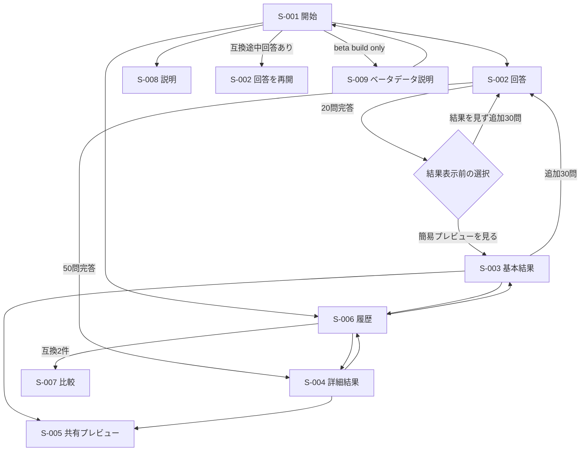

# Big Five自己理解支援ツール 画面設計

| 項目 | 内容 |
|---|---|
| 設計版 | 0.3 |
| 作成日 | 2026-07-20 |
| 更新日 | 2026-07-21 |
| 入力要件 | 要件定義書v1.7 |
| 対象 | スマートフォン優先、PC対応 |

## 1. 画面方式

- 【想定】1つの`index.html`を入口とするクライアントサイドアプリ。
- 【想定】GitHub Pagesの404を避けるため`#/start`等のハッシュルートを使う。
- URLへ回答・スコア・結果・個人情報を含めない。
- 直接アクセス時は端末保存と現在状態を検証し、安全な画面へ遷移する。
- ブラウザバックだけに依存せず、画面内に明示的な戻る・中断・破棄導線を用意する。

## 2. 画面一覧

| 画面ID | ルート | 名称 | 対応機能ID |
|---|---|---|---|
| S-001 | `#/start` | 開始 | F-001, F-004, F-007, F-009, F-014 |
| S-002 | `#/answer` | 回答 | F-002, F-003, F-004, F-013, F-015 |
| S-003 | `#/result/preview` | 基本結果 | F-005, F-007, F-008, F-014, F-016, F-018 |
| S-004 | `#/result/detail` | 詳細結果 | F-006, F-007, F-008, F-014, F-016, F-018 |
| S-005 | `#/share` | 共有プレビュー | F-011, F-012, F-014, F-015, F-016, F-018 |
| S-006 | `#/history` | 履歴 | F-009, F-010, F-013, F-014, F-015 |
| S-007 | `#/compare` | 比較 | F-010, F-015 |
| S-008 | `#/about` | 説明 | F-001, F-002, F-007, F-014 |
| S-009 | `#/beta-data` | ベータデータ説明 | F-017 |

## 3. 主要遷移

## 4. 共通レイアウト・操作

- 本文最大幅を設け、PCで行長を過度に広げない。
- 360px幅で横スクロールを発生させない。
- 主要ボタンのタップ領域は44×44 CSS px以上を目標とする。
- フォーカスを常に視認可能にし、モーダルを使う場合はフォーカストラップと復帰先を実装する。
- 色だけで選択・高低・増減・エラーを表さず、文言・記号・線種を併用する。
- `prefers-reduced-motion`では結果発表アニメーションを省略する。
- 読み上げ順とDOM順を一致させる。
- 長い結果文は省略せず折り返す。補足節は開閉可能にしても、重要な注意書きは初期表示する。

## 5. S-001 開始

### 表示

- サービス名、「自己理解支援ツール」の表記
- Big Five（五因子モデル）を使用すること
- 対象: 18歳以上、本人が一人で回答
- 20問・50問のおおよその所要時間
- 臨床診断、能力・採用判定ではないこと
- 端末保存と、削除・端末変更で復元できないこと
- アプリ版・診断関連版への導線
- 互換途中回答がある場合のみ「続きから」
- 履歴がある場合のみ「過去の結果」
- ベータ版では、回答開始ボタンより前に匿名集計を行うことを示す短い通知とS-009への導線

### 操作

- 「20問から始める」
- 「続きから」
- 「履歴を見る」
- 「尺度・結果の読み方」

### 状態・エラー

- 保存不可でも新規開始を許可し、「この環境では続きと履歴を保存できません」と通知する。
- 不正な途中回答は「続きから」を出さず、壊れた記録だけを除外する。

## 6. S-002 回答

### 表示

- 設問本文
- 5件法の選択肢。値の方向を誤解しない自然言語ラベル
- 現在位置と全体数
- 前へ、破棄
- 自動保存状態。成功を毎回読み上げず、失敗だけ通知

### 操作

- 回答タップで選択し、次の設問へ進む。
- 前の設問へ戻り、回答を変更できる。
- 破棄は確認後に開始画面へ戻る。
- 再読み込みは互換版なら保存位置から再開する。

### 20問完答時

結果や因子名を表示する前に、次の2択を出す。

- 「20問の簡易プレビューを見る」
- 「結果を見ずに、あと30問続ける」

後者ではスコア、仮称号、仮猫、色候補を描画せず、21問目へ進む。

### バリデーション

- 未回答のまま次へ進ませない。
- 値は整数1〜5だけを受け付ける。
- 設問ID、現在位置、定義版が一致しない場合は処理を止め、安全な再開始を案内する。

## 7. S-003 基本結果

### ファーストビュー

- 「20問簡易プレビュー」
- 仮称号、仮猫キャラクター
- 「本アプリ独自のプロフィール表現」
- 短い人物像
- 枠・5軸・補助線・数値を備えたレーダーチャート
- 5因子の数値テキスト
- 日本語版20項目が独立検証済みではない旨

### 続き

- 特徴的な2因子と、称号になった理由
- 境界・僅差時の補足
- 5因子の両極バー、短い説明、「説明を見る」展開ボタン
- 50問で確認できる内容
- 標準1＋代替2の色候補と、3場面×各2件の香調候補。追加回答は要求しない
- 「あと30問続ける」
- 「共有する」「履歴を見る」

### 失敗時

- 猫画像失敗: 代替文と称号を維持
- Canvas失敗: HTMLの数値一覧を維持
- 履歴保存失敗: 結果を維持し、保存不可を通知

## 8. S-004 詳細結果

### 表示

- 「50問詳細結果」
- 称号、猫、人物像、レーダーチャート
- 称号の代表2因子と全5因子
- 客観的な観察文、強みとして表れやすい面、裏返りとして出やすい面
- 仕事、人間関係、ストレス等の場面を考える柔らかな問いかけと行動ヒント
- 5因子ごとの「説明を見る」展開ボタン
- 振り返り文の後の補助注記 `※因子名の「説明を見る」から、それぞれの意味を確認できます。`
- 根拠・限界への導線
- 境界・僅差時の補足
- 色候補と香調候補
- 共有、履歴、再診断

### 表現制約

- 断定、優劣、適職・採用、臨床的助言を表示しない。
- 3番目以降の因子を省略しない。
- 色・香りを科学的診断や改善方法として表示しない。

## 9. 色候補の任意操作

S-003/S-004に複数パレットを表示する。

- 初期状態はTitleProfileDefinitionの標準パレット。
- 標準1件と代替2件、合計3件を固定表示する。
- 候補タップでカードプレビュー用の配色を変更する。
- 選択状態は色＋チェック＋名称で示す。
- 「選ばない」という追加回答を要求せず、標準状態のまま共有可能。
- 配色変更はスコア、称号、猫、結果文を変更しない。
- 履歴にパレットIDを保存し、後から同じカードを再生成できる。

香調候補は「ひと息つきたい」「気持ちを切り替えたい」「静かに取り組みたい」の固定順で、各2件、合計6件を同時表示する。共有プレビューでは各場面の代表1件、合計3件へ要約する。

## 10. S-005 共有プレビュー

### 表示

- 実際に外部へ出る画像
- 共有テキスト全文
- 20問／50問の区別
- 猫、称号、レーダー、短文、色候補反映、香調候補、注意書き、版
- 選択配色と猫が同系色の場合も確認できる、縁取り・影・背景プレートを含む完成時と同一のプレビュー
- 生回答や公開結果URLが含まれないこと

### 操作

- 「端末の共有メニュー」
- 「画像を保存」
- 「テキストをコピー」
- 「結果へ戻る」

利用可能な機能だけを表示する。実行前に画像Blobとテキストの生成成功を確認する。

### フォールバック順

1. 画像ファイル付きWeb Share
2. PNGダウンロード
3. テキストのClipboardコピー
4. 選択可能な共有テキスト表示

Q-007確定前の【想定】:

- PNG
- 猫画像は全体表示、中央配置、トリミングなし
- 選択パレットは維持し、猫の再配色や同系色パレットの除外は行わない
- 猫と隣接背景の分離が弱い場合は、明暗二重縁取り、影、ニュートラル背景プレートをカードテンプレート側で適応する
- 日本語テキストはCanvasへ描画前にフォント読込完了を待つ

## 11. S-006 履歴

### 表示

- 新しい順の結果カード
- 実施日時、20問／50問、称号、猫、5因子、版
- 根拠文とコメントの展開
- 空状態: 「まだ結果がありません」と診断開始導線

### 操作

- 詳細を開く
- 比較対象を選ぶ
- 個別削除
- 全削除

### 比較選択

- 1件目選択後、互換結果だけを2件目候補として有効化する。
- 非互換は理由を表示する。
- 2件選択後、古い結果→新しい結果の順でS-007へ進む。

## 12. S-007 比較

### 表示

- 比較条件と各バージョン
- 古い結果、今回の結果
- 5因子の丸め前差から作った表示差
- 増減を色だけに頼らない記号と文言
- 「性格の確定的変化ではない」という注意
- 表現版が異なる場合の補足

### エラー

- 直接URLで比較IDがない: S-006へ戻す。
- 一方が削除済み・破損: 利用可能な履歴を維持し、再選択を案内。
- 非互換: 比較を行わず理由を表示。

## 13. S-008 説明

- Big Five（五因子モデル）の説明
- 採用尺度と出典・利用条件
- 20問と50問の違い
- 0〜100が尺度内スコアであること
- 称号・猫・色・香りが非診断的な表現であること
- 日本語版利用上の限界
- 端末保存、非送信、削除方法
- 問い合わせ先（Q-010）
- アプリ版と全診断関連版

## 14. S-009 ベータデータ説明

ベータ版だけで表示し、S-001の回答開始前から1操作で到達できるようにする。個別の同意チェック画面ではなく、収集内容を事前に理解できる説明画面とする。

### 表示

- 目的: 設問選択傾向、称号分布、20問／50問完了数、共有カードで実利用された色の把握
- 送信時点: 回答完了時、色付きカードの保存またはOS共有成功時
- 送信項目: 版、設問数、設問IDと選択肢、称号ID、色ID、カード操作種別
- 保存しない項目: 氏名、メール、アカウント、Cookie識別子、端末ID、個人単位の回答履歴、結果履歴、自由記述、IP・User-Agent・Refererの永続ログ
- 送信先: OCI VPSの集計APIと既存PostgreSQL
- 通常公開版では送信しないこと
- 通信失敗でも診断結果、履歴、共有に影響しないこと
- 感想収集はGoogleフォーム等へ分離し、フォーム側で別途同意すること
- 問い合わせ先とデータ保持方針。Q-010/Q-011確定までは【準備中】と明示し、ベータを外部公開しない

### 操作

- 「ベータ版の診断へ戻る」
- 「通常版について確認する」または通常版URLへの導線【想定】
- 外部アンケートは診断完了後の任意リンクとし、匿名集計の送信結果をクエリへ含めない

集計送信中の専用画面は設けない。結果画面を先に表示し、失敗時だけ非阻害の通知を出す。

## 15. 画面遷移完全性

| 画面・状態 | 入口 | 正常な次 | 戻る／取消 | 中断・再読込 | 空状態 | エラー後の回復 |
|---|---|---|---|---|---|---|
| S-001 初回 | URL | S-002 | - | S-001 | 履歴・続き非表示 | 保存なしで開始可 |
| S-002 回答中 | S-001/再開 | 次問または20問分岐 | 前問／破棄 | 互換途中回答を復元 | 初期質問 | 入力維持して再試行 |
| S-002 20問分岐 | 20問完答 | S-003または21問目 | 回答へ戻る | 分岐状態を復元 | 非該当 | 結果を見せず選択再表示 |
| S-003 基本結果 | 20問分岐/履歴 | S-002/S-005/S-006 | S-001 | 履歴から復元 | 非該当 | テキスト結果を維持 |
| S-004 詳細結果 | 50問完答/履歴 | S-005/S-006 | S-001 | 履歴から復元 | 非該当 | テキスト結果を維持 |
| S-005 共有 | 結果 | OS共有/保存/コピー | 元結果 | 再生成 | 画像失敗時テキスト | 段階フォールバック |
| S-006 履歴 | S-001/結果 | 結果/S-007 | S-001 | 再読込 | 診断開始 | 破損行を除外 |
| S-007 比較 | S-006 | S-006 | S-006 | 選択IDを再検証 | 2件未満なら案内 | 再選択 |
| S-008 説明 | 任意画面 | 呼出元 | 呼出元 | S-008 | 非該当 | 静的本文を表示 |
| S-009 ベータ説明 | S-001／説明リンク | S-001 | S-001 | S-009を再表示 | 保持方針準備中を表示 | 静的説明を維持 |

## 16. 代表ビューポートと検証

- 360×800: 最小対象。横スクロール、固定要素被り、長文、5件法を確認
- 390×844: 主なスマートフォン
- 768×1024: タブレット
- 1280×800: PC
- 200%文字拡大、キーボードのみ、スクリーンリーダーの主要フロー
- ダークモードはMVP必須ではない。実装する場合もコントラストを再検証する。
