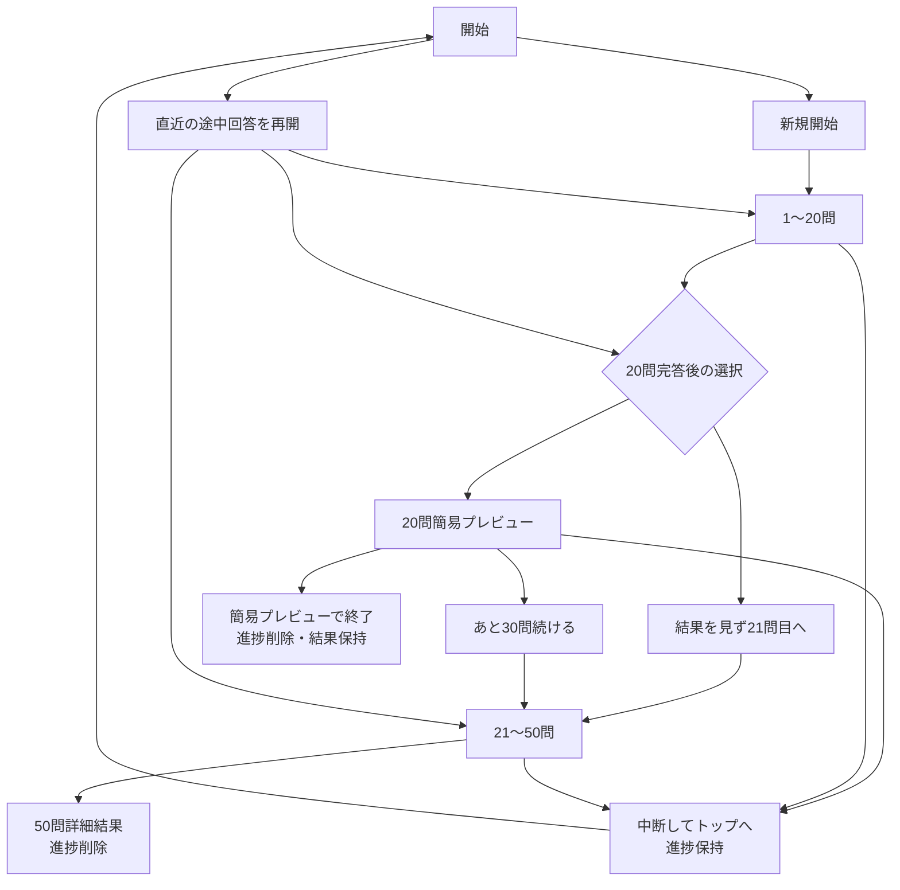

# 結果・履歴・中断再開 UI再設計

- 状態: ユーザー承認済み
- 対象版: `mvp-0.1.0`
- 対象機能: F-003、F-004、F-005、F-006、F-008、F-009、F-010、F-013、F-015、F-018
- 対象タスク: T-004、T-005、T-006、T-008A、T-008
- 承認日: 2026-07-27

## 1. 目的

本アプリの独自性である「称号」と「猫」を結果発表の主役にしながら、5因子スコアと説明の根拠へ段階的に到達できるようにする。スマートフォンでの縦スクロールを抑え、回答中断、20問簡易プレビューからの継続、履歴比較を迷わず操作できる構成へ整理する。

本設計は次の正典を具体化する。

- 要件: `docs/requirements/2026-07-20-big-five-self-understanding-requirements.md`
- 画面: `docs/screens.md`
- データ: `docs/data-model.md`
- 処理: `docs/processing-design.md`
- タスク: `docs/tasks.md`

## 2. 共通ヘッダーと設問表示

### 2.1 アプリ名

- 正式名称は `Big Five｜自己理解支援ツール` を維持する。
- 全画面に小さく控えめな共通ヘッダーを表示する。
- 狭幅では任意位置で折り返さず、`Big Five｜`と`自己理解支援ツール`の意味の境界でだけ改行できる構造にする。
- 結果画面でもアプリ名を確認できるようにするが、称号と猫より視覚的に強くしない。

### 2.2 設問

- 正式な設問文は変更しない。
- 左揃え、適切な最大幅、行間、`text-wrap: balance`相当で、スマートフォンでは不自然な1語残りを避けた2〜3行を目安にする。
- 文字を過度に縮小して1行へ押し込まない。

## 3. 結果画面の情報優先度

結果画面は次の順とする。

1. 結果種別（20問簡易プレビュー／50問詳細結果）と控えめなアプリ名
2. 称号、猫、中立副題、「本アプリ独自のプロフィール表現」
3. `この称号になった理由`
4. 任意提案と分かる`振り返りのヒント`
5. レーダーチャートと5因子スコア
6. 因子ごとの段階的な説明
7. 色候補と香調候補
8. 因子ごとの設問構成
9. 測定の土台、計算方法、限界、出典・利用条件
10. 共有、履歴、再診断、トップへ戻る等の操作

`この称号になった理由`は初期表示する短文とし、版付き結果文定義から取得する。因子スコアは診断結果から動的に表示する。結果文を後で変更しても、履歴は診断時の`RenderedResultText`を表示する。

`振り返りのヒント`は測定結果と分離し、`もし合いそうなら、参考にしてみてください`と添える。20問は固定順1件目だけ、50問は1件目を初期表示し、`ほかのヒントを見る`で残り最大2件を同一階層に展開する。第三階層、ランダム選択、共有物への転載は行わない。

## 4. スコアの全体像

### 4.1 レーダーチャート

- 5軸に因子名を表示する。
- 因子の固定順は、知性・想像力、勤勉性、外向性、協調性、情緒安定性とする。
- Canvasが利用できなくても、直下の5因子一覧で同じ数値を確認できるようにする。

### 4.2 5因子一覧

レーダーチャート直下に、各因子について次を1行にまとめる。

- 因子名
- 0〜100の横棒
- 数値スコア
- 小さな`説明を見る`

`0–100`は数値スコア列の見出しとして、各数値の上に1回だけ表示する。棒グラフ列の見出しにはしない。

## 5. 因子説明の段階展開

### 5.1 第一段階

- 5因子のうち同時に開けるのは1因子だけとする。
- 因子を開くと、次のカテゴリを表形式に近い区切りで表示する。
  - 今の傾向
  - 活かしやすい強み
  - 強みの裏返り
  - 仕事での現れ方
  - 人間関係での現れ方
  - ストレス時の傾向
  - 振り返りと行動ヒント
- 各カテゴリは短いサマリ文と、小さな`詳しく見る`を持つ。
- 短いサマリ文はカテゴリの役割を説明する固定UI文面とし、診断時結果文の自動要約は行わない。`詳しく見る`で該当する`RenderedResultText`を表示する。

### 5.2 第二段階

- 同時に開ける長文カテゴリは1件だけとする。
- 別カテゴリを開いた場合は、それまでのカテゴリを閉じる。
- 別因子を開いた場合は、前の因子とその配下の長文を閉じる。
- 開閉後も、開いた見出しが画面上に残るようスクロール位置を調整する。
- 第三階層は設けない。
- ResultSnapshotのsection-first配列は変更せず、表示時だけ因子別へ投影する。`question`と`action`は「振り返りと行動ヒント」の1カテゴリにまとめ、展開時は両方の診断時結果文へ到達できるようにする。

## 6. 測定根拠と固定説明

### 6.1 因子ごとの設問構成

結果画面の方法説明より上に`因子ごとの設問構成を見る`を置く。設問本文や利用者の回答は表示せず、今回の20問／50問モードに応じて、因子ごとの正方向項目数と逆方向項目数だけを表形式で示す。

### 6.2 固定説明

次の4項目を、タップ可能なボタンから同一画面上のボトムシートまたは同等のアクセシブルなオーバーレイで表示する。

- 測定の土台
- スコアの計算方法
- この結果の限界
- 出典・利用条件

説明内容は称号やスコアでは変化しない。診断定義版と20問／50問モードだけを参照する。hover専用ツールチップにはせず、キーボード操作、フォーカストラップ、閉じた後のフォーカス復帰を保証する。

## 7. 色候補と香調候補

- 色選択は共有用結果カードの背景、装飾、グラフ等の配色だけを変える。
- スコア、称号、猫、結果文、通常画面全体の配色は変えず、猫を再配色しない。
- 色選択は猫カード／共有カードプレビューの直近に置く。
- 香調候補も主結果グループの猫カード近くへ置くが、猫から導かれた提案とは表現しない。
- 香調候補は診断結果の版付きselectorから決まり、実行時AI生成を行わない。
- 色と香りは測定結果そのものではなく、非診断的な演出・雰囲気づくりのヒントであることを控えめに区別する。

## 8. 履歴

### 8.1 通常表示

履歴カードは次だけを初期表示する。

- 小さな猫サムネイル（該当1体を遅延読み込み）
- 称号
- 実施日時
- 20問／50問バッジ
- `結果を見る`

5因子スコア、全結果文、内部`characterId`、版情報、個別削除等の管理操作は通常カードへ並べない。`結果を見る`は保存済みResultSnapshotを使って通常の結果画面を開く。診断時の結果文は保持し、現在の結果文定義から再生成しない。

### 8.2 比較

- 履歴画面下部に比較用の固定アクションバーを置き、リスト末尾まで移動しなくても比較へ進めるようにする。
- 通常時は`結果を比較する`を表示する。
- 比較モードではカード全体を選択トグルとして扱う。
- 1件目選択後は互換結果だけを2件目候補として有効にし、非互換結果には理由を表示する。
- 最大2件。2件選択しても自動遷移せず、`選択した2件を比較`で明示的に進む。
- 比較モードでは`キャンセル`と選択件数を表示する。

### 8.3 管理

- 履歴ヘッダーの`…`から、`データの管理`ボトムシート／モーダルを開く。実施日時・20問／50問で識別できる個別削除、全削除、版情報をまとめ、個別削除を通常カードへ常時表示しない。
- 管理画面には明示的な`閉じる`を置く。背景部分のタップ、Escキーでも閉じられるようにし、内部操作のタップでは閉じない。
- 開いたときは管理画面内へフォーカスを移し、閉じた後は起動元の`…`へ戻す。背景をキーボード・読み上げ操作の対象に残さない。
- 全削除は確認を必須とする。
- 固定ヘッダー／固定フッターはsafe areaを考慮し、本文末尾へ十分なpaddingを確保する。

### 8.4 50問結果からの退出

- 50問詳細結果の操作欄に`トップへ戻る`を置き、`#/start`へ直接移動できるようにする。
- ResultSnapshotを履歴へ保存できている場合は確認なしで戻る。
- 保存失敗により結果が現在画面にしか存在しない場合は、戻ると再表示できないことを確認し、取消時は結果画面を維持する。
- `トップへ戻る`と`もう一度診断する`を別操作として表示する。前者は新規ProgressRecordを作らず、後者だけが新規診断を開始する。

## 9. 中断・再開

### 9.1 共通原則

- 回答は従来どおり各遷移後に自動保存する。
- 回答画面の固定ヘッダーに`中断してトップへ`を置き、回答数に関係なく利用できるようにする。
- `中断してトップへ`はProgressRecordを保持して開始画面へ戻る。
- 保存できない環境では、離れると回答が失われることを操作前に通知する。
- 破棄は管理メニュー等の別操作として残し、確認後にProgressRecordだけを削除する。
- 再開対象は診断種別ごとに直近1件だけとし、一覧は作らない。

### 9.2 20問前後の再開先

| 中断時の状態 | 開始画面の表示 | 再開先 |
|---|---|---|
| 1〜19問回答済み | `途中から再開する` | 最初の未回答設問 |
| 20問完答・選択前 | `途中から再開する` | 20問完答後の選択画面 |
| 簡易プレビュー表示済み | `残り30問を再開する` | 21問目 |
| 21〜49問回答済み | `途中から再開する` | 最初の未回答設問 |
| 50問完答 | 表示しない | ProgressRecordを削除済み |

簡易プレビュー画面には次を置く。

- 主操作: `あと30問続ける`
- 副操作: `中断してトップへ`。20問のProgressRecordを保持する。
- 控えめな操作: `簡易プレビューで終了する`。20問ResultSnapshotは履歴へ残し、ProgressRecordだけを削除する。

`簡易プレビューで終了する`は20問ResultSnapshotの履歴保存を確認できた場合だけ有効にする。履歴保存に失敗したlive結果では、結果を失わない`中断してトップへ`または`あと30問続ける`を案内する。ProgressRecord削除に失敗した場合は結果画面に留まり、終了済みと表示せず再試行を案内する。

### 9.3 新規開始

互換ProgressRecordがある状態で新規診断を選んだ場合は、`現在の途中回答は破棄されます`と確認する。取消時は既存ProgressRecordを保持し、確定時だけ同じ診断種別のProgressRecordを新規状態へ置き換える。保存済みResultSnapshotは削除しない。

## 10. 状態遷移

## 11. フォールバック

- localStorage保存失敗: 同一セッションでは回答・結果を維持し、再開できないことを通知する。
- 猫失敗: 称号、理由、スコア、結果文、履歴操作を維持する。
- Canvas失敗: 5因子一覧と説明を維持する。
- ボトムシートを利用できない環境: 明示的な閉じる操作とフォーカス復帰を持つ同一DOM内のインライン展開へ切り替える。
- 固定ヘッダー／フッターが表示領域を圧迫する場合も、320px狭幅・200%相当で本文と最終操作を隠さない。

## 12. 受入条件

- 360px幅でアプリ名と設問が不自然に1語だけ折り返されず、横スクロールがない。
- 結果のファーストビューで称号、猫、理由がスコア詳細より先に理解できる。
- レーダーの因子名、5因子の棒・数値・説明導線を利用できる。
- 開いている因子1件、長文カテゴリ1件の制約をキーボードでも維持する。
- 因子ごとの正方向・逆方向の項目数を20問／50問で切り替え、設問本文と回答を表示しない。
- 履歴カードが簡潔で、固定アクションバーから互換2件を選択して比較できる。
- 履歴のデータ管理画面を閉じるボタン、背景タップ、Escで閉じ、起動元へフォーカスを戻せる。
- 保存済み50問結果から確認なしでトップへ戻れ、未保存live結果では離脱前に確認できる。
- 回答途中、20問選択前、簡易プレビュー後、21〜49問の各状態を正しい位置から再開できる。
- `簡易プレビューで終了する`は20問結果を残し、再開データだけを削除する。
- 途中回答がある新規開始は、確認の取消では保持、確定時だけ置換する。
- 保存、猫、Canvasの各失敗時にも診断結果と安全な退出経路を維持する。
