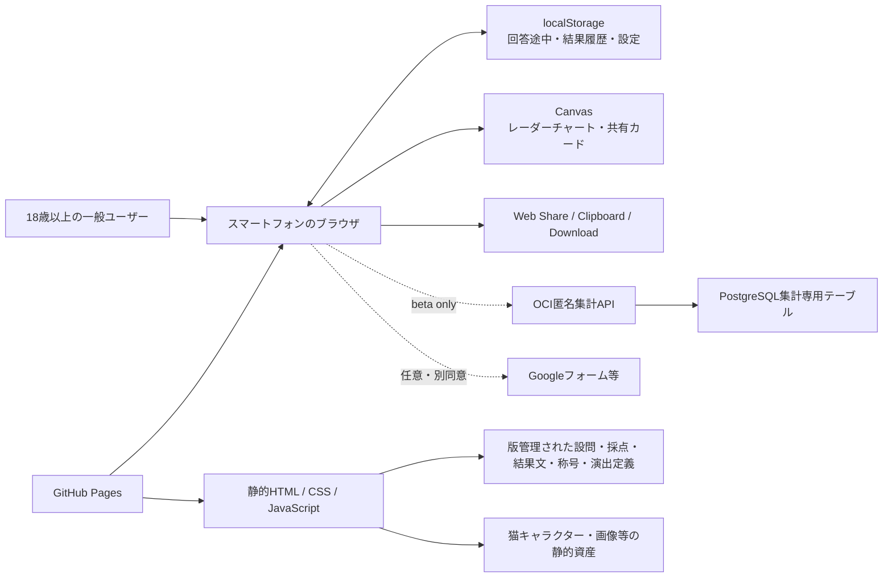

# Big Five自己理解支援ツール 基本設計サマリ

## 1. 文書情報

| 項目 | 内容 |
|---|---|
| 設計版 | 0.8 |
| 作成日 | 2026-07-20 |
| 更新日 | 2026-07-28 |
| 対象フェーズ | MVP＋ベータ |
| 要件定義 | `docs/requirements/2026-07-20-big-five-self-understanding-requirements.md` v1.13 |
| 想定リリース表記 | `mvp-x.x.x` |
| 実装主体 | Codex |

本書は、要件定義から実装へ進む際の入口を示す。詳細は各基本設計書と `docs/tasks.md` を正とする。

### CSVコンテンツ基盤の現在地（2026-07-26）

Q-006およびT-005/F-002/F-005/F-006/F-016のコンテンツ作成基盤は実装済みである。人が編集する正典は`content/source/`の版付きCSVであり、3つのrelease schema、4つのコンパイラ、決定的な7 JSON builder、atomic writer、CSV/ES Modules parity testを持つ。初期件数は50問、固定20問、51称号、237結果文、6根拠である。

これはruntime activationや人手Content Approvalの完了を意味しない。E-0のみ`approved`、E-1〜E-5は`draft`、T/F/Xは人手approval metadataなしの`reviewed`で、Q-013のproduction release CSVと診断release CSVは未作成である。Q-013の構造・compiler・検証fixtureは実装済みだが、本番の全パレット・香調データは未制作である。Q-012は全51体の原画・WebP・alt・manifest・単一画像loaderまで制作・技術実装済みだが、正式なapproved release選択は未完了である。現在のruntime compatibility authorityは既存ES Modules、通常モードの外部通信は0件、CSPは`connect-src 'none'`である。JSON runtime loadingとPages deploymentは`docs/superpowers/plans/2026-07-26-csv-content-activation-pages.md`で扱う。activation後は人がCSVだけを更新し、ActionsがJSONを生成する。

## 2. 入力品質ゲート

基本設計に必要な入力品質は満たしている。

- F-001〜F-018は、目的・優先度・受け入れ条件または具体的な振る舞いを追跡できる。
- 性能、セキュリティ、プライバシー、アクセシビリティ、運用、互換性の非機能要件が定義されている。
- MVPの対象、対象外、主要画面、正常系・例外系、保存・削除方針が明確である。
- 結果称号の境界・同点ルールは `title-rule-v1` として確定している。
- Q-012とQ-013の構造、Q-014の結果・履歴・中断再開UIは確定済み。Q-013は香り素材を独立マスタ化し、Q-014は称号別の振り返りヒント、50問結果のトップ導線、閉じられる履歴管理画面を含む。Q-006人手Content Approval、Q-013コンテンツ制作、Q-007〜Q-011の運用・公開値を影響タスクの開始条件として管理する。

## 3. 全体アーキテクチャ

通常公開MVPはサーバー処理を持たない静的Webアプリとする。診断、採点、結果生成、履歴、比較、画像生成、共有はブラウザ内で完結する。ベータ版だけOCI匿名集計APIと既存PostgreSQLを使用し、個人単位イベントを保存しない。公開結果URL、アカウント、利用者認証は設けない。

## 4. 設計判断

| 区分 | 判断 |
|---|---|
| 確定 | Big Fiveを用いた「心理診断」ではなく「自己理解支援ツール」と表示する |
| 確定 | IPIP系の公開項目を候補に、出典・翻訳・改変・採点ロジックを版管理する |
| 確定 | 20問の短縮体験と、そこから継続できる50問版を提供する |
| 確定 | 20問終了時は結果を先に見せず、「結果を見る」「50問まで続ける」を選べる |
| 確定 | 結果履歴、再診断、同条件結果の比較、回答途中からの再開を端末内で提供する |
| 確定 | 回答数に関係なく明示的に中断でき、20問選択前・簡易プレビュー後・21〜49問を状態に応じて再開する。再開対象は診断種別ごとの直近1件だけとする |
| 確定 | 20問簡易プレビューは、追加30問の継続、中断、20問結果を残した終了を区別する |
| 確定 | 履歴には数値だけでなく、根拠文、解説、称号、版情報を保存する |
| 確定 | 履歴の通常カードは猫・称号・日時・20/50問・結果表示へ絞り、固定下部操作から互換2件をトグル選択する |
| 確定 | 履歴のデータ管理は明示的な閉じる、背景タップ、Esc、起動元へのフォーカス復帰を持つボトムシート／モーダルとする |
| 確定 | 結果発表では称号と猫を主役とし、理由、任意の振り返りヒント、名前付きレーダー、5因子、段階説明、方法情報の順に表示する |
| 確定 | 50問結果にはトップへの直接導線を置き、未保存live結果だけ離脱前に確認する |
| 確定 | 結果称号は猫モチーフで最大51種類とし、人間・人型キャラクターは用いない |
| 確定 | 色はパレット単位、香りは香調候補と香り素材の独立マスタとしてID参照し、追加回答を必須にしない |
| 確定 | 選んだ色で共有カードの配色を変更でき、カードをユーザー操作で保存・共有できる |
| 確定 | 選択色と猫が同系色でも色を差し替えず、適応的な縁取り・影・背景プレートでカード上の猫の視認性を維持する |
| 確定 | 公開結果URLは作らず、画像・テキストをユーザー操作で共有する |
| 確定 | フロントエンドはGitHub Pagesで公開する |
| 確定 | ベータ版だけ稼働中のOCI VPSと既存PostgreSQLを匿名集計に使用する |
| 確定 | 設問・称号・色のマスタと集計カウンターを分離し、個人単位イベントをDBへ保存しない |
| 確定 | ベータ開始前に収集内容を明示し、感想収集はGoogleフォーム等で別同意とする |
| `[想定]` | 正式実装は `app/` に置き、`prototype-big-five/` は検証済み参考資産として凍結する |
| `[想定]` | Vanilla JavaScriptのES Modulesを使い、フレームワークとビルド必須化を避ける |
| `[想定]` | GitHub Pagesの直リンク耐性を優先し、画面遷移はハッシュルーティングを使う |
| `[想定]` | アプリ版の正本を `app/js/config/app-meta.js` に集約する |
| `[想定]` | 端末内データは単一の版付きエンベロープとして `localStorage` に保存する |
| `[想定]` | ドメイン処理は純粋関数として分離し、`node:test` とブラウザスモークテストで検証する |
| `[想定]` | 本文は端末のシステムフォントを基本とし、外部フォントを必須にしない |

`[想定]` は、実装開始時に安全に変更できる可逆的な技術判断である。変更する場合は、関連する基本設計書とタスクの完了条件も同期する。

## 5. 設計書の役割

| 文書 | 役割 |
|---|---|
| `AGENTS.md` | Codexが守るプロジェクト構成、実装規約、禁止事項、検証方針 |
| `docs/data-model.md` | 静的マスタ、端末内データ、ベータ集計マスタ・カウンター、保持方針 |
| `docs/screens.md` | 画面一覧、状態遷移、操作、レスポンシブ、アクセシビリティ |
| `docs/processing-design.md` | 採点、称号判定、結果生成、比較、共有、匿名集計、例外処理 |
| `docs/api-design.md` | ベータ匿名集計API、バリデーション、冪等性、エラー、ログ制限 |
| `docs/tasks.md` | F-001〜F-018と非機能要件から実装タスクへのトレーサビリティ |

### ベータAPI設計

通常公開MVPには実行時APIがない。一方、F-017のベータ匿名集計を採用したため、`docs/api-design.md`を新設した。完答時の設問選択肢・称号・完了数と、色付きカード保存・共有成功時の色利用数だけを集計し、個人単位イベントを保存しない。通信失敗やDB停止は診断結果を阻害せず、通常版はAPIを呼び出さない。

## 6. 未決事項と着手ゲート

未決事項は「忘れずに後で決めるもの」であり、基本設計全体のブロッカーではない。

| ID | 主な論点 | 決定期限 | 影響 |
|---|---|---|---|
| Q-006 | 51称号、結果文、因子説明、根拠対応表のCSV基盤は実装済み。人手Content Approvalとapproved release選択が未完了 | release選択前 | T-005 |
| Q-007 | 共有画像の寸法、形式、トリミング、文字量 | 共有画面実装前 | T-007 |
| Q-008 | GitHub Pagesの公開元、Actionsワークフロー、初期URL、任意のカスタムドメイン | 公開設計前 | T-011 |
| Q-009 | ベータ参加者の募集方法とアンケート手段 | ベータ開始前 | T-010 |
| Q-010 | 公開時の問い合わせ先、利用規約、プライバシー説明 | 正式公開前 | T-009、T-011 |
| Q-011 | 集計値・冪等キー・バックアップの保持期間、ベータ終了後の処理、API公開ドメイン | ベータ公開前 | T-010運用 |

Q-012の量産仕様とQ-013の候補数・分類・選択規則は設計条件として解決済みである。Q-013は2026-07-28に香り素材の独立マスタ、香調ごとの素材ID 1〜3件、通常結果だけの表示、共有除外、安全表現を確定した。色は個々のHEXではなくパレット単位のマスタを維持する。Q-012全51体は2026-07-27に制作・技術実装済みだが、正式なapproved release選択は未完了でrelease gateとして維持する。Q-014は称号別の振り返りヒント、50問結果のトップ導線、閉じられる履歴管理画面まで2026-07-28に追補承認済みである。残る全パレット・香調・素材例・振り返り文面は設計判断ではなくコンテンツ制作とContent Approvalとして管理する。

## 7. 実装順序

推奨順序は次のとおり。

1. T-001: 正式アプリの静的構成、ルーター、版情報、テスト基盤【完了】
2. T-002: IPIP固定定義と権威データ検証【F-002・版レジストリ／開始／共有モデル契約まで完了】
3. T-003: 採点、`title-rule-v1`、51分類、結果モデル【完了。Q-006 initial reviewed copyとQ-012画像統合もT-005で後続実装済み】
4. T-004: 回答状態機械、20問・50問分岐、途中保存、削除【基盤完了。Q-014の明示中断・状態別再開・preview終了UIを追加】
5. T-005: 結果画面、猫、レーダー、色・香り【live結果・猫・レーダー完了。Q-014の情報階層とQ-013実データを追加】
6. T-006: 履歴、比較、削除【基盤完了。Q-014の簡潔カード・固定比較導線を追加】
7. T-007: 共有カード、保存、コピー、同系色時の猫視認性補助
8. T-008〜T-009: 全画面統合、アクセシビリティ、説明、プライバシー
9. T-010: ベータ匿名集計API・PostgreSQL・事前説明。外部公開はQ-009/Q-011確定後
10. T-011: GitHub Pages CI/CD、監視、切り戻し
11. T-012: MVP受入、対象ブラウザ、性能、公開前検証

現在の次実装単位は、`docs/superpowers/specs/2026-07-27-result-history-resume-ui-design.md`に基づくT-008Aの結果hero・因子二段階展開・方法情報・トップ導線・履歴管理モーダルの画面接続である。回答中断・状態別再開・preview終了、簡潔な履歴・固定比較導線は実装済みである。称号別の振り返りヒントは`docs/superpowers/specs/2026-07-28-title-reflection-comments-design.md`、Q-013の素材例は`docs/superpowers/specs/2026-07-28-fragrance-material-examples-design.md`に従い、版付きCSV、通常結果だけの表示、共有除外として後続実装する。Q-012は制作・技術実装済みだが正式なrelease gateは未解決であり、Q-006人手Content ApprovalとQ-013色・香り実データも独立した公開ゲートとして維持する。確定データの代わりに仮文面・仮アセットを本番定義へ入れない。

## 8. 今回の更新範囲

### 作成・更新した文書

- `AGENTS.md`
- `docs/requirements/2026-07-20-big-five-self-understanding-requirements.md` v1.13
- `docs/基本設計サマリ.md`
- `docs/data-model.md`
- `docs/screens.md`
- `docs/processing-design.md`
- `docs/api-design.md`
- `docs/tasks.md`
- `docs/superpowers/specs/2026-07-28-fragrance-material-examples-design.md`
- `docs/superpowers/specs/2026-07-28-title-reflection-comments-design.md`
- `docs/superpowers/specs/2026-07-27-result-history-resume-ui-design.md`

### 更新しない文書・資産

- `docs/superpowers/specs/2026-07-20-big-five-prototype-design.md`: プロトタイプ時点の判断記録として保持する。
- `docs/superpowers/plans/2026-07-20-big-five-prototype.md`: ユーザーの既存変更を含むため、今回の基本設計では変更しない。
- `prototype-big-five/`: 正式実装の比較対象として保持し、今回変更しない。
- `README.md`: T-001完了時に正式版のローカル起動・検証手順を作成済み。後続タスクで公開手順を追記する。

## 9. 実装開始条件

T-001〜T-004の基盤、T-005のlive／保存済み結果・Q-012猫・レーダー、T-006の履歴・比較基盤に加え、T-008Aの回答中断・状態別再開・preview終了、簡潔な履歴・固定比較導線、結果用純粋モデルを実装済みである。T-004の`continueHidden`は20問の結果モデルを生成せず21問目へ遷移し、保存障害でもメモリ上の診断を継続できる。次は結果hero・因子二段階展開・方法情報の画面接続であり、Q-006人手Content Approval、Q-013色・香り実データ、T-007共有を独立した後続ゲートとして維持する。未制作データは静的定義へ閉じ込め、UI・保存・判定コードに直接埋め込まない。

### T-002完了（2026-07-21）

IPIP日本語50項目の固定定義、20項目プレビュー順、独立authority fixture、版参照・不変性・破損検知、開始画面の診断版表示、共有モデルの版契約を実装した。F-014の全消費先が完了したという意味ではなく、実際の共有出力はT-007、結果・履歴を含む全画面統合はT-008、説明画面の版表示はT-009に残る。次の実装単位はT-003（採点、`title-rule-v1`、51分類、結果モデル）である。

### T-003完了（2026-07-23）

`scoreDiagnostic`は固定設問と回答を受け、逆転後の`rawMean`、有理数からhalf-upした表示用整数、band、顕著度、支持数、母分散を持つ5件の`FactorResult`を返す。`title-rule-v1`は`rawMean`だけで0/1/2/3+顕著因子を分類し、浮動小数誤差を同点・境界判定へ持ち込まず、支持数、分散、`factor-order-v1`の順で決定的に解消する。51件の不変プロフィール定義は40組合せ、10単一、1バランス型を一意の称号・キャラクターIDへ対応させる。版付き固定結果文は明示条件で検証・選択し、結果モデルはexact schemaの`renderedTexts`と5因子だけを深く複製して、生回答や未知フィールド、本番文面の仮生成を許可しない。Q-006の本番文章とQ-012の画像は後続タスクへ残る。次の実装単位はT-004である。

### T-004完了（2026-07-25）

`response-state`は`DiagnosticDefinition.previewQuestionIds`と`detailQuestionIds`だけを順序源として、現在設問への整数1〜5回答、戻る、置換、20問出口、50問終端を純粋に遷移する。`continueHidden`は21問目へ進むための進捗だけを返し、20問スコア、称号、キャラクター、結果・共有モデルを出力しない。`showPreview`後の詳細継続は表示済みdecisionを保持する。`progress-storage`は正式キー`big-five-self-understanding:v1`でschema 1を検証し、遷移直後の自動保存、版不一致・将来schema・破損値の非破壊処理、save/discard時の無関係破損レコード隔離を行う。完答後の結果保存・進捗削除はT-005の境界とする。T-005はQ-006本文、3体パイロット、色・香り実データを制作ゲートとして残す。
