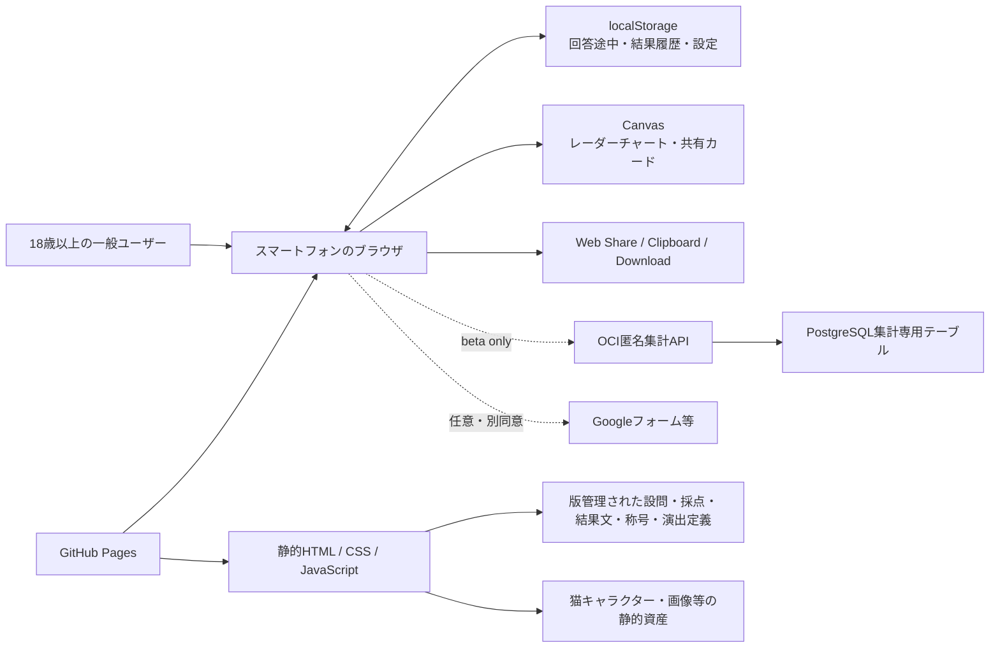

# Big Five自己理解支援ツール 基本設計サマリ

## 1. 文書情報

| 項目 | 内容 |
|---|---|
| 設計版 | 0.15 |
| 作成日 | 2026-07-20 |
| 更新日 | 2026-08-03 |
| 対象フェーズ | MVP＋ベータ |
| 要件定義 | `docs/requirements/2026-07-20-big-five-self-understanding-requirements.md` v1.40 |
| 現在リリース | `mvp-1.0.1` |
| 実装主体 | Codex |

本書は、要件定義から実装へ進む際の入口を示す。詳細は各基本設計書と `docs/tasks.md` を正とする。

### CSVコンテンツ基盤の現在地（2026-07-26）

Q-006およびT-005/F-002/F-005/F-006/F-016のコンテンツ作成基盤は実装済みである。人が編集する正典は`content/source/`の版付きCSVであり、3つのrelease schema、4つのコンパイラ、決定的な7 JSON builder、atomic writer、CSV/ES Modules parity testを持つ。初期件数は50問、固定20問、51称号、237結果文、6根拠である。

Q-006のE/F/T/Xは2026-07-28に承認済みとなり、現行`result-text-v2`のTR-0〜TR-4（51称号×3件）も2026-07-30までに承認・runtime実装済みである。ただし、これはCSV approved releaseの選択完了を意味しない。Q-013は`presentation-v2`の全パレット、29香調、25素材、306関連行、compiler、検証、監査、確認資料まで作成済みで、2026-07-31にP-0〜P-6を承認し、同日承認済みCSVからES Modules runtimeを決定的に生成・接続した。結果DOMの3パレット選択・履歴保存、ココロアロマ6候補表示、1080×1800の正式共有CanvasとS-005も実装済みである。2026-08-02に承認済み`kokoro-wreath-v2.png`を正式採用し、猫ごとのalpha下端に追従して背面へ合成する方式へ更新した。共有テキストは代表3件の香調と素材例を含む。production release CSV選択とQ-012の正式approved release選択は未完了である。現在のruntime compatibility authorityは生成済みES Modules、通常モードの外部通信は0件、CSPは`connect-src 'none'`である。JSON runtime loadingとPages deploymentは`docs/superpowers/plans/2026-07-26-csv-content-activation-pages.md`で扱う。activation後は人がCSVだけを更新し、ActionsがJSONを生成する。

2026-08-02の承認済みUIトーンとして、全ページ主見出しを24pxへ統一し、開始画面へ土なし芽アイコンと履歴0件時の無効ボタンを追加した。結果は実施日時を主見出し直下へ移し、称号、理由、注意、補足カードを緑灰色の穏やかな文字階層へそろえた。5因子以降はパレット、アロマ、称号カードCTA、今回の結果、根拠の順とし、共有画面は`TITLE CARD`／`称号カード`と通常間隔の戻る副ボタンを使う。

同日の追補で、開始画面の履歴副ボタンを診断操作と同じメインカード内へ移動した。履歴管理モーダルは通常操作を緑系、削除候補を淡い赤系、最終確認の削除だけを明確な赤系とし、`診断時の情報を見る`で展開する版情報を小さな補助文字へ整理した。

## 2. 入力品質ゲート

基本設計に必要な入力品質は満たしている。

- F-001〜F-018は、目的・優先度・受け入れ条件または具体的な振る舞いを追跡できる。
- 性能、セキュリティ、プライバシー、アクセシビリティ、運用、互換性の非機能要件が定義されている。
- MVPの対象、対象外、主要画面、正常系・例外系、保存・削除方針が明確である。
- 結果称号の境界・同点ルールは `title-rule-v1` として確定している。
- Q-007、Q-012、Q-013の構造、Q-014の結果・履歴・中断再開UIは確定済み。Q-007の1080×1800共有Canvas、S-005、共有・保存・コピー・段階代替、承認済み`kokoro-wreath-v2.png`を実装済みである。Q-013はP-0〜P-6の全人手承認、`presentation-v2` ES Modules runtime生成、結果DOMの色選択・保存と香り6候補接続まで完了した。Q-014は承認済みの称号別振り返りヒント、50問結果のトップ導線、閉じられる履歴管理画面を含む。Q-006と`result-text-v2`のContent Approval、T-008B/T-008Cの履歴preview・比較・パレット／アロマ・共有導線追補も完了している。Q-008〜Q-011の運用・公開値を影響タスクの開始条件として管理する。

## 3. 全体アーキテクチャ

通常公開MVPはサーバー処理を持たない静的Webアプリとする。診断、採点、結果生成、履歴、比較、画像生成、共有はブラウザ内で完結する。ベータ版だけOCI匿名集計APIと既存PostgreSQLを使用し、個人単位イベントを保存しない。公開結果URL、アカウント、利用者認証は設けない。

## 4. 設計判断

| 区分 | 判断 |
|---|---|
| 確定 | Big Fiveを用いた「心理診断」ではなく「自己理解支援ツール」と表示する |
| 確定 | IPIP系の公開項目を候補に、出典・翻訳・改変・採点ロジックを版管理する |
| 確定 | 20問の短縮体験と、そこから継続できる50問版を提供する |
| 確定 | 20問終了時は結果を先に見せず、「結果を見る」「50問まで続ける」を選べる |
| 確定 | 50問目の回答後も即時確定せず、完答確認の「結果を見る」で確定する。「回答へ戻る」から前の設問を見直し・変更できる |
| 確定 | 結果履歴、再診断、同条件結果の比較、回答途中からの再開を端末内で提供する |
| 確定 | 回答数に関係なく明示的に中断でき、20問選択前・簡易プレビュー後・21〜49問を状態に応じて再開する。再開対象は診断種別ごとの直近1件だけとする |
| 確定 | 20問簡易プレビューは、50問への継続と20問結果を残した終了を区別する。20問`showPreview`のResultSnapshotは対応ProgressRecordの`progressId`を`resultId`として使い、履歴から継続する場合は両ID、mode、20回答、VersionTupleが完全一致する時だけ許可する。50問`detail50`は新しい`resultId`を持つ。旧preview/progressの異なるIDは推測再リンクせず、保存フィールドとschema versionは追加しない |
| 確定 | 履歴には数値だけでなく、根拠文、解説、称号、版情報を保存する |
| 確定 | 履歴の通常カードは猫・称号・日時・20/50問・結果表示へ絞り、固定下部操作から互換2件をトグル選択する。履歴から開いた保存済み結果はヘッダーと最下部から履歴一覧へ戻す。20問履歴は完全一致の途中回答がある回答継続中と、それ以外の確定済みに分け、前者だけに継続を表示する |
| 確定 | 比較画面は前回・今回・差を同じ0〜100表示軸と固定桁で示し、差の数値と状態文を二段表示する。比較条件の版情報は項目別に表示する |
| 確定 | 履歴のデータ管理は明示的な閉じる、背景タップ、Esc、起動元へのフォーカス復帰を持つボトムシート／モーダルとする |
| 確定 | 結果発表では称号と猫を主役とし、理由、任意の振り返りヒント、名前付きレーダー、5因子、段階説明、方法情報の順に表示する |
| 確定 | 50問結果にはトップへの直接導線を置き、未保存live結果だけ離脱前に確認する |
| 確定 | 結果称号は猫モチーフで最大51種類とし、人間・人型キャラクターは用いない |
| 確定 | 色はパレット単位、香りは香調候補と香り素材の独立マスタとしてID参照し、追加回答を必須にしない |
| 確定 | 結果画面の`ココロパレット`は常時3候補を表示し、選択しても閉じない。`ココロアロマ`は閉じた3画像ティーザーから1回で6候補を開く。5因子とアロマは相互排他、パレットは対象外とする |
| 確定 | 結果画面の`ココロパレット`副題は`〜あなたらしさから着想した色の選択〜`、`ココロアロマ`副題は`〜あなたらしさから着想した香りの提案〜`とする。パレット注釈は3候補の下で右揃えとする |
| 確定 | 選んだ色で共有カードの配色を変更でき、カードをユーザー操作で保存・共有できる |
| 確定 | 選択色と猫が同系色でも色を差し替えず、適応的な縁取り・影でカード上の猫の視認性を維持する。現行`card-template-v2`では補正版の透過ラスタリースを猫より先にCanvasへ合成し、猫ごとのalpha下端を基準に配置する。白色・ニュートラル色の円形面や背面プレートを置かない。`card-template-v1`の旧円形リースは維持する |
| 確定 | 公開結果URLは作らず、画像・テキストをユーザー操作で共有する |
| 確定 | フロントエンドはGitHub Pagesで公開する |
| 確定 | ベータ版だけ稼働中のOCI VPSと既存PostgreSQLを匿名集計に使用する |
| 確定 | 設問・称号・色のマスタと集計カウンターを分離し、個人単位イベントをDBへ保存しない |
| 確定 | ベータ開始前に収集内容を明示し、感想収集はGoogleフォーム等で別同意とする |
| `[想定]` | 正式実装は `app/` に置き、`prototype-big-five/` は検証済み参考資産として凍結する |
| `[想定]` | Vanilla JavaScriptのES Modulesを使い、フレームワークとビルド必須化を避ける |
| `[想定]` | GitHub Pagesの直リンク耐性を優先し、画面遷移はハッシュルーティングを使う |
| `[想定]` | アプリ版の正本を `app/js/config/app-meta.js` に集約する |
| `[想定]` | 端末内データは単一の版付きエンベロープとして `localStorage` に保存する |
| `[想定]` | ドメイン処理は純粋関数として分離し、`node:test` とブラウザスモークテストで検証する |
| `[想定]` | 本文は端末のシステムフォントを基本とし、外部フォントを必須にしない |

`[想定]` は、実装開始時に安全に変更できる可逆的な技術判断である。変更する場合は、関連する基本設計書とタスクの完了条件も同期する。

## 5. 設計書の役割

| 文書 | 役割 |
|---|---|
| `AGENTS.md` | Codexが守るプロジェクト構成、実装規約、禁止事項、検証方針 |
| `docs/data-model.md` | 静的マスタ、端末内データ、ベータ集計マスタ・カウンター、保持方針 |
| `docs/screens.md` | 画面一覧、状態遷移、操作、レスポンシブ、アクセシビリティ |
| `docs/processing-design.md` | 採点、称号判定、結果生成、比較、共有、匿名集計、例外処理 |
| `docs/api-design.md` | ベータ匿名集計API、バリデーション、冪等性、エラー、ログ制限 |
| `docs/tasks.md` | F-001〜F-018と非機能要件から実装タスクへのトレーサビリティ |

### ベータAPI設計

通常公開MVPには実行時APIがない。一方、F-017のベータ匿名集計を採用したため、`docs/api-design.md`を新設した。完答時の設問選択肢・称号・完了数と、色付きカード保存・共有成功時の色利用数だけを集計し、個人単位イベントを保存しない。通信失敗やDB停止は診断結果を阻害せず、通常版はAPIを呼び出さない。

## 6. 未決事項と着手ゲート

未決事項は「忘れずに後で決めるもの」であり、基本設計全体のブロッカーではない。

| ID | 主な論点 | 決定期限 | 影響 |
|---|---|---|---|
| コンテンツrelease | Q-006の全18 gateと`result-text-v1` Content Approval、`result-text-v2`のTR-0〜TR-4、Q-013のP-0〜P-6とES Modules runtime生成・接続は完了。approved JSON release未選択、Q-006関連行status未昇格、Q-012正式releaseが未完了 | release選択前 | T-005 |
| Q-008 | GitHub Pagesの公開元、Actionsワークフロー、初期URL、任意のカスタムドメイン | 公開設計前 | T-011 |
| Q-009 | ベータ参加者の募集方法とアンケート手段 | ベータ開始前 | T-010 |
| Q-010 | 公開時の問い合わせ先、利用規約、プライバシー説明 | 正式公開前 | T-009、T-011 |
| Q-011 | 集計値・冪等キー・バックアップの保持期間、ベータ終了後の処理、API公開ドメイン | ベータ公開前 | T-010運用 |

Q-007は1080×1800（3:5）PNG、中央ブランド、称号ラベルと称号、承認済み`kokoro-wreath-v2.png`、猫の全体表示・中央配置・トリミングなし、固定5因子、ココロアロマ副題と透過素材画3件、注記・モード・アプリ版の縦配置を確定し、共有モデル、Canvas、S-005、段階フォールバックまで実装済みである。リースを猫の背面へ合成し、猫ごとのalpha下端へ追従する。プレビュー、Web Share、PNG保存は同じBlobを使う。共有テキストは固定3場面の香調と素材例を含み、任意`shareUrl`を除いて結果画面・カード画像にURLを出さない。Q-012の量産仕様とQ-013の候補数・分類・選択規則も設計条件として解決済みである。香りは称号から着想した非診断的な演出であり、具体的な商品、使い方、効果を案内しない。猫は1024×1024透過WebP、香り画は短辺800px以上の透過PNG、リースは1254×1254透過PNG、ブランドは512px PNGを使う。Q-012全51体は制作・技術実装済みだが、正式なapproved release選択は未完了でrelease gateとして維持する。

## 7. 実装順序

推奨順序は次のとおり。

1. T-001: 正式アプリの静的構成、ルーター、版情報、テスト基盤【完了】
2. T-002: IPIP固定定義と権威データ検証【F-002・版レジストリ／開始／共有モデル契約まで完了】
3. T-003: 採点、`title-rule-v1`、51分類、結果モデル【完了。Q-006 initial reviewed copyとQ-012画像統合もT-005で後続実装済み】
4. T-004: 回答状態機械、20問・50問分岐、途中保存、削除【基盤とQ-014の明示中断・状態別再開・preview終了UIまで完了】
5. T-005: 結果画面、猫、レーダー、色・香り【live結果・猫・レーダー、Q-014結果UX、Q-013候補データ・P-0〜P-6承認・ES Modules runtime生成、結果DOMの3パレット選択・保存とアロマ6候補まで完了】
6. T-006: 履歴、比較、削除【簡潔カード・保存済み結果導線・結果詳細の履歴一覧戻り・固定比較導線・閉じられる履歴管理dialogまで完了】
7. T-007: 共有カード、保存、コピー、同系色時の猫視認性補助【承認済み`kokoro-wreath-v2.png`を含め実装・実Canvas確認済み】
8. T-008B: 結果履歴・比較・ココロパレット／アロマのUI追補
9. T-008〜T-009: 全画面統合、アクセシビリティ、説明、プライバシー
10. T-010: ベータ匿名集計API・PostgreSQL・事前説明。外部公開はQ-009/Q-011確定後
11. T-011: GitHub Pages CI/CD、監視、切り戻し
12. T-012: MVP受入、対象ブラウザ、性能、公開前検証

T-008A/T-008Cは、回答中断・状態別再開・preview終了、結果heroと称号理由の分離、固定順5因子の行全体から1回で全カテゴリ本文を開く結果UX、設問構成sheetと4方法sheetを最下部の「結果の根拠と見方」へ集約する構成、50問トップ導線、簡潔な履歴・固定比較導線、履歴管理dialogとアプリ内削除確認まで画面接続済みである。初期状態では本文を閉じ、開けるのは1因子またはアロマ1件だけとする。方法sheetは固定ヘッダーと本文スクロールを分離し、閉じる・正確なbackdrop click・Escape・focus復帰を備える。称号カードCTAは方法カードより前へ置き、共有画面の拡大・結果復帰操作を副ボタンへ統一する。`result-text-v1`の237件は全18 gateがapprovedとなり、Q-006のContent Approvalを2026-07-28に完了した。`result-text-v2`の称号別振り返りヒント153件、Q-013のP-0〜P-6も承認済みで、`presentation-v2` ES Modules runtimeへ生成・接続済みである。approved JSON release未選択とQ-012正式releaseは独立した公開ゲートとして維持する。

## 8. 今回の更新範囲

### 作成・更新した文書

- `AGENTS.md`
- `docs/requirements/2026-07-20-big-five-self-understanding-requirements.md` v1.13
- `docs/基本設計サマリ.md`
- `docs/data-model.md`
- `docs/screens.md`
- `docs/processing-design.md`
- `docs/api-design.md`
- `docs/tasks.md`
- `docs/superpowers/specs/2026-07-28-fragrance-material-examples-design.md`
- `docs/superpowers/specs/2026-07-28-title-reflection-comments-design.md`
- `docs/superpowers/specs/2026-07-27-result-history-resume-ui-design.md`

### 更新しない文書・資産

- `docs/superpowers/specs/2026-07-20-big-five-prototype-design.md`: プロトタイプ時点の判断記録として保持する。
- `docs/superpowers/plans/2026-07-20-big-five-prototype.md`: ユーザーの既存変更を含むため、今回の基本設計では変更しない。
- `prototype-big-five/`: 正式実装の比較対象として保持し、今回変更しない。
- `README.md`: T-001完了時に正式版のローカル起動・検証手順を作成済み。後続タスクで公開手順を追記する。

## 9. 実装開始条件

T-001〜T-004の基盤、T-005のlive／保存済み結果・Q-012猫・レーダー・Q-013結果DOM、T-006の履歴・比較基盤、T-007の共有モデル・1080×1800 Canvas・S-005・段階代替、T-008Aの`titleReflection`を含む画面接続、T-008B/T-008Cの履歴preview・比較・パレット／アロマ／共有導線UIを実装済みである。T-007は承認済み`kokoro-wreath-v2.png`と猫ごとの下端追従を含み、異なる小物構成の猫3体で実Canvas確認済みである。結果画面は通常20問8件／50問45件の保存済み結果文を、称号・猫hero、独立した称号理由、称号別ヒント、固定順5因子の結果として表示する。現行は因子1回で保存済み全カテゴリ本文を表示し、カテゴリ内の汎用サマリと三段目の開閉は置かない。完全な振り返り3件組を得られない履歴互換時だけ7件／42件へフォールバックする。T-004の`continueHidden`は20問の結果モデルを生成せず21問目へ遷移し、保存障害でもメモリ上の診断を継続できる。全削除成功時は保存値と画面内の途中回答・live結果を同時に破棄する。Q-013のP-0〜P-6人手承認、ES Modules runtime、3パレット選択・保存、香り6候補表示は完了した。Q-012正式approved release選択は独立した後続ゲートとして維持する。

T-008C（2026-08-01）は上記の結果・履歴表示規則を現行実装へ追補する。5因子は因子1回の操作で保存済み全カテゴリ本文を表示し、二段階のカテゴリ開閉は行わない。20問`showPreview`の`resultId`は`progressId`と同一で、履歴継続は両ID、mode、20回答、VersionTupleが完全一致する時だけ許可する。パレットは常時3候補、アロマは閉じた3画像ティーザーから一回で6候補、因子とアロマは相互排他である。5状態のパレット・アロマ・共有CTA・戻り操作は`docs/screens.md`の表を正とし、因子領域の`拡大して見る`は置かない。S-005の共有画像拡大は維持する。

T-008Cのうち今回の共有追補はF-011、F-012、F-013、F-018に対応する。F-013は20問プレビュー完了時にResultSnapshotを残してProgressRecordを削除し、共有可能な完了状態を確定する範囲だけで関係する。Blob／Object URLはF-011／F-012の責務である。共有テキストはブランド、モード、称号、副題、見出しなし理由、固定順因子、アロマの場面・香調・素材例、標準注意書き、任意HTTPS URLの順とし、`publicOrigin`を共有URLへ暗黙転用しない。v2共有カードは後者の補正版透過ラスタリースとローカル高解像度透過素材を使い、プレビュー、Web Share、PNG保存は同じBlobを再利用する。称号カードCTAは方法カードより前、共有画面の拡大・結果復帰は副ボタンとする。Canvasまたは共有APIが失敗しても、コピーまたは選択可能なテキストへ到達できる。両追補は未解決のcontent/release gateを変更しない。

### T-002完了（2026-07-21）

IPIP日本語50項目の固定定義、20項目プレビュー順、独立authority fixture、版参照・不変性・破損検知、開始画面の診断版表示、共有モデルの版契約を実装した。F-014の全消費先が完了したという意味ではなく、実際の共有出力はT-007、結果・履歴を含む全画面統合はT-008、説明画面の版表示はT-009に残る。次の実装単位はT-003（採点、`title-rule-v1`、51分類、結果モデル）である。

### T-003完了（2026-07-23）

`scoreDiagnostic`は固定設問と回答を受け、逆転後の`rawMean`、有理数からhalf-upした表示用整数、band、顕著度、支持数、母分散を持つ5件の`FactorResult`を返す。`title-rule-v1`は`rawMean`だけで0/1/2/3+顕著因子を分類し、浮動小数誤差を同点・境界判定へ持ち込まず、支持数、分散、`factor-order-v1`の順で決定的に解消する。51件の不変プロフィール定義は40組合せ、10単一、1バランス型を一意の称号・キャラクターIDへ対応させる。版付き固定結果文は明示条件で検証・選択し、結果モデルはexact schemaの`renderedTexts`と5因子だけを深く複製して、生回答や未知フィールド、本番文面の仮生成を許可しない。Q-006の本番文章とQ-012の画像は後続タスクへ残る。次の実装単位はT-004である。

### T-004完了（2026-07-25）

`response-state`は`DiagnosticDefinition.previewQuestionIds`と`detailQuestionIds`だけを順序源として、現在設問への整数1〜5回答、戻る、置換、20問出口、50問完答確認、明示確定を純粋に遷移する。`continueHidden`は21問目へ進むための進捗だけを返し、20問スコア、称号、キャラクター、結果・共有モデルを出力しない。`showPreview`後の詳細継続は表示済みdecisionを保持する。50問目の回答は結果を作らず完答進捗を保存し、「回答へ戻る」で見直し、「結果を見る」で初めてResultSnapshotを生成する。`progress-storage`は正式キー`big-five-self-understanding:v1`でschema 1を検証し、遷移直後の自動保存、版不一致・将来schema・破損値の非破壊処理、save/discard時の無関係破損レコード隔離を行う。明示確定後の結果保存・進捗削除はT-005の境界とする。
